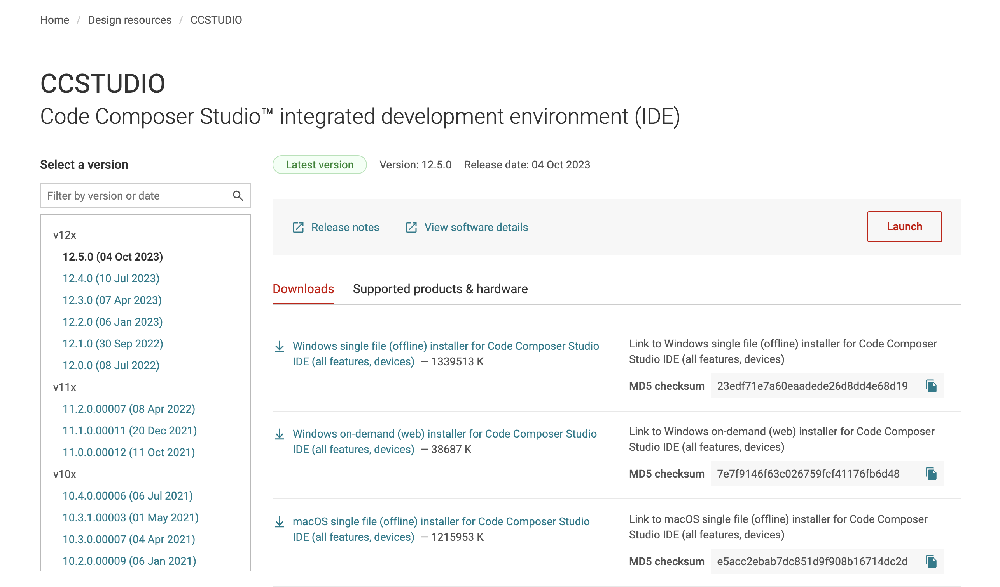
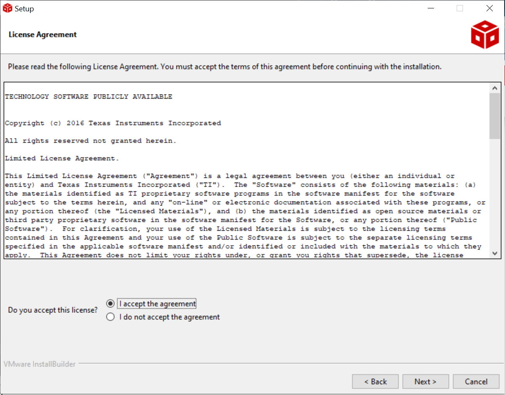
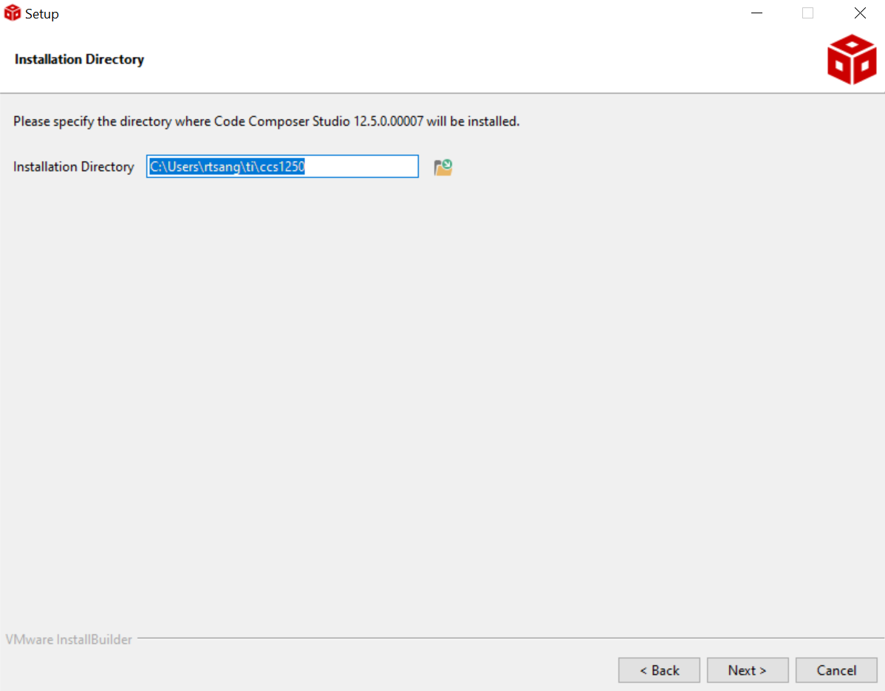
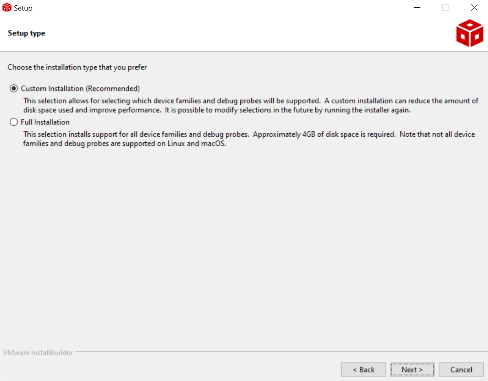
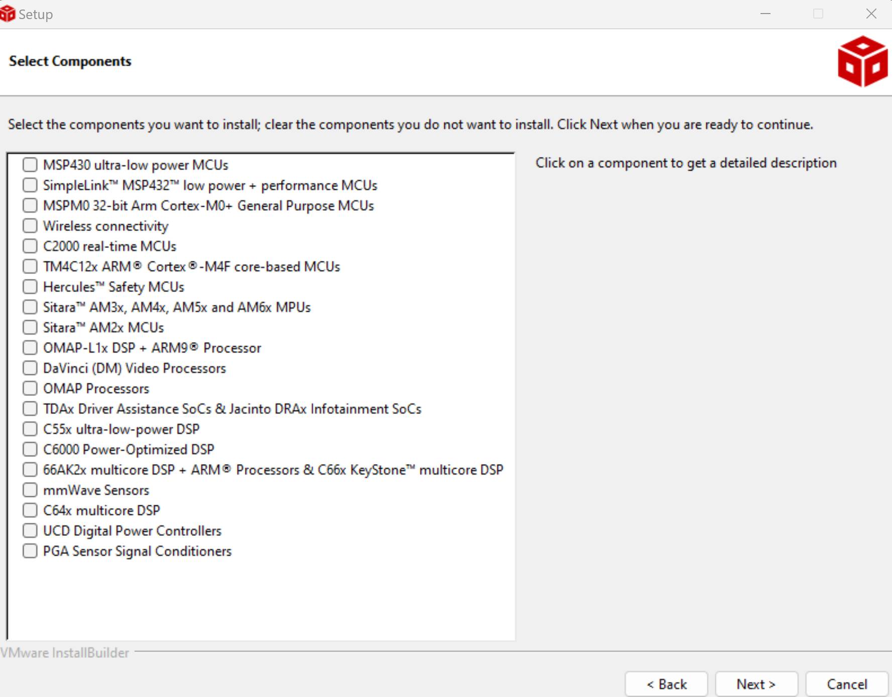
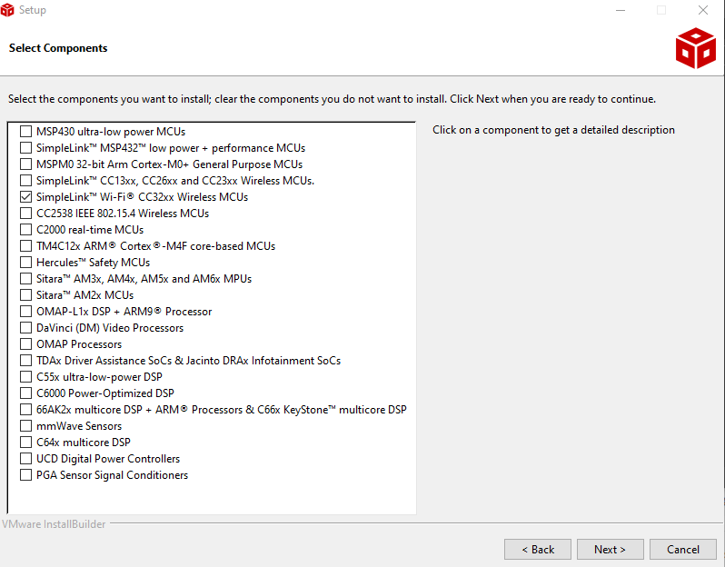
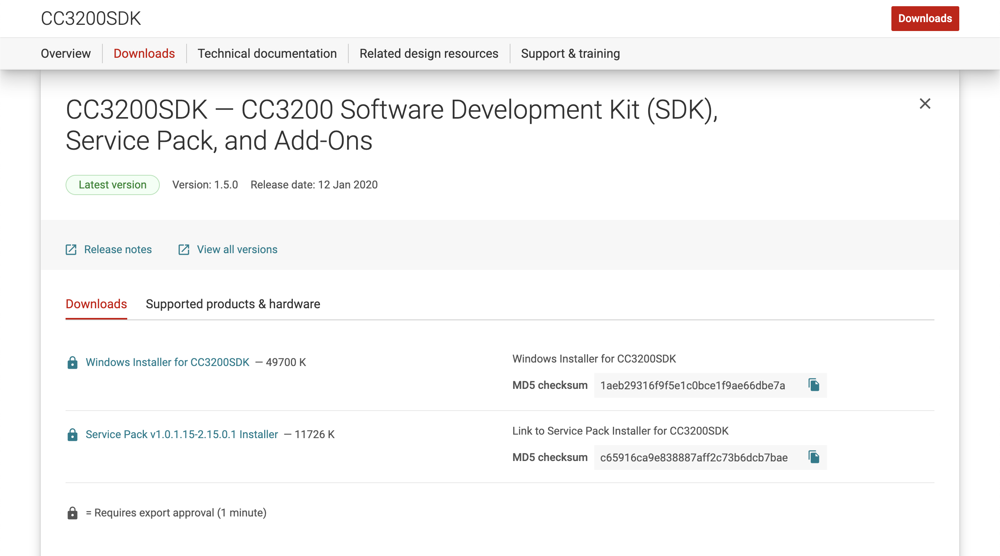
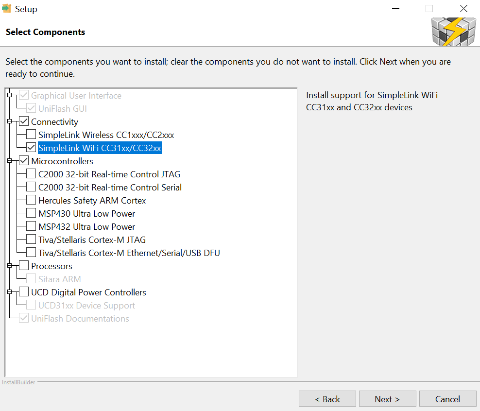

# Requirements

The following software must be installed on your own computer to use it
for project development. The software is already installed on the lab
computers. OS-specific walkthroughs can be found further below.

Note that to download some of the TI software, you will need to set up a
TI account. Establish your own account to download the software instead
of trying to get it in some other way.

1.  **Code Composer Studio (CSS) IDE** [latest]

    <https://www.ti.com/tool/CCSTUDIO>

    > Download and install the latest version of CCS. You will have access
    > to the full-featured version (not code-size or time limited) when
    > using the CC3200 LaunchPad.

2.  **CC3200 Software Development Kit** [v1.5.0] and
    **CC3200SDK-ServicePack** [v1.0.1.15-2.15.0.1]

    (Windows-Only) <https://www.ti.com/tool/cc3200sdk>

3.  **TI SYSCONFIG Tool** [latest]

    <https://www.ti.com/tool/SYSCONFIG>

4.  **CCS UniFlash** [3.4.1] or **cc3200tool** [latest]

    <https://www.ti.com/tool/download/UNIFLASH/3.4.1>
    <https://github.com/toniebox-reverse-engineering/cc3200tool>

5.  **PuTTY**, **TeraTerm**, or other Terminal emulator (Windows-Only)
    (we will use the `cc3200tool term` for mac)

    > You will use a terminal emulator program for serial input and output
    > to you CC3200. You can use any terminal emulator program that you
    > prefer. The lab machines will have PuTTY (available at
    > <http://www.putty.org/>) and Tera Term (available from
    > <https://ttssh2.osdn.jp/index.html.en>).

6.  **Saleae Logic 2** (Optional)

    <https://www.saleae.com/downloads/>

    > This is software to use the Saleae Logic Analyzer. Between you and your
    > lab partner, only one of you will need this software if you wish to use
    > the logic analyzer for digital signal debugging, as you will be sharing
    > one logic analyzer anyways.


# Windows 10/11

## Installing CCS

1.  Visit the [CCS Download Page](https://www.ti.com/tool/download/CCSTUDIO).
    Download the `Windows on-demand (online) installer for Code Composer
    Studio IDE (all features, devices)` for v12.5.0 by clicking on the link.

    <div class="fig">
        
        <span class="caption">CCS Download Page</span>
    </div>

2.  Right-Click on the downloaded archive and select **Extract All**. Then 
    find the setup application `ccs_setup_12.5.0.x`. Right-Click on it and 
    select **Run as Administrator**.

3.  **(License Agreement)** Continue through the installer, and when prompted, 
    accept the License Agreement.

    <div class="fig">
        
        <span class="caption">CCS License Agreement</span>
    </div>

4.  **(Install Directory)** Choose a location to install CCS. It should be 
    somewhere on your `C:\` drive and easy to remember, as you will install the 
    other tools to the same directory. (We recommend `C:\Users\<user>\ti\`)

    <div class="fig">
        
        <span class="caption">Select CCS Install Directory</span>
    </div>

5.  **(Installation Type)** Select `Custom Installation`

    <div class="fig">
        
        <span class="caption">Installation Type</span>
    </div>

6.  **(Select Components)** Check the box corresponding to `Wireless Connectivity`
    or `SimpleLink™* Wi-Fi® CC32xx Wireless MCUs`, depending on what appears. 
    You will not need any other components for this course.

    <div class="fig">
      <div style='display: inline-block; vertical-align: bottom;'>
        
        <span class="caption">Select Components (Wireless Connectivity)</span>
      </div>
      <div style='display: inline-block; vertical-align: bottom;'>
        &nbsp;&nbsp;&nbsp;&nbsp;
      </div>
      <div style='display: inline-block; vertical-align: bottom;'>
        
        <span class="caption">Select Components (SimpleLink™* Wi-Fi® CC32xx Wireless MCUs)</span>
      </div>
    </div>

7.  **(Install Debug Probes)** We will not be using any of the other debug 
    probes beyond the default. Leave the boxes unchecked and continue.

8.  **(Finish Installation)** Continue through the rest of the installer until
    the process is complete.

## Installing CC3200 Support Files

1.  Visit the [SDK Download Page](https://www.ti.com/tool/download/CC3200SDK).
    Download most recent version of the `Windows Installer for CC3200SDK` and 
    the `Service Pack Installer`. Both of these require a TI Account. When
    prompted, indicate "Civil Use", agree to the License Agreement, and
    continue. 

    <div class="fig">
        
        <span class="caption">Select Components</span>
    </div>

2.  Run both of the downloaded installers. We recommend installing them to the
    same location as CCS. Continue through the windows until finished.

## Installing TI SysConfig

1.  Visit the [SysConfig Download Page](https://www.ti.com/tool/download/SYSCONFIG).
    Download the `Windows Installer for SysConfig`.

2.  Run the `sysconfig-x.x.x_x-setup` application. Continue through all the 
    windows. When prompted, select the install directory, then continue 
    until installation complete.

## Installing UniFlash v3.4.1

**Note: It must be version 3.4.1 or earlier, as no later versions are 
compatible with the CC3200**

1.  Visit the [UniFlash Download Page](https://www.ti.com/tool/download/UNIFLASH/3.4.1).
    Download the `Windows Installer for UniFlash`.

2.  Right-Click on the downloaded archive and select **Extract All**. Then 
    find the setup application `uniflash_setup_3.4.1.x`. Right-Click on it and 
    select **Run as Administrator**. 

3.  **(Select Components)** Agree to any license agreements, and continue 
    through the installer. Choose your install directory, and when you reach 
    the "Select Components" page, choose `Connectivity -> SimpleLink WiFi 
    CC31xx/CC32xx`, as shown below. Then continue through the rest of the 
    installer. **If prompted to install FTDI drivers, click *Yes***.

    <div class="fig">
        
        <span class="caption">Select Components</span>
    </div>

## Installing PuTTY

1.  We recommend PuTTY over TeraTerm, though it doesn't matter too much. To 
    install PuTTY, if you have Chocolatey, you can run:

    ```console
    choco install putty
    ```

    from an Administrator shell. Otherwise, you can install from the 
    Microsoft Store, or you can install manually.

2.  **(Manual Install)** 
    Visit the [PuTTY Download Page](https://www.chiark.greenend.org.uk/~sgtatham/putty/latest.html)
    and download the Installer for your machine's architecture. Then run it and
    follow the prompts. (You can use defaults)

## Installing Saleae Logic 2

1.  Follow the Installation instructions on Saleae's Support website, 
    found [here](https://support.saleae.com/logic-software/sw-installation#windows-instructions)


# MacOS Catalina or Later

(Tested on Sonoma, Apple M1 Pro)

The labs can be done on macOS, but will require extensive use of the 
Terminal, as cc3200tool is a python command line tool. We have had to modify
it to some extent, so for things to work properly, you will need to setup a
[conda](https://github.com/conda-forge/miniforge) environment. If you are not
familiar with navigating the Terminal, you can refer to [this crash course on
the command line](https://developer.mozilla.org/en-US/docs/Learn/Tools_and_testing/Understanding_client-side_tools/Command_line)
as well as this [neat cheat sheet](https://github.com/0nn0/terminal-mac-cheatsheet)
of common commands.

We will go through the full installation process using 
[Homebrew](https://brew.sh/), as this will greatly ease the installation 
process.

## Install Homebrew

Homebrew is a package manager for macOS, similar to Chocolatey on Windows and 
apt in Ubuntu. It can be used to install and uninstall most libraries, tools, 
and applications cleanly and easily. (*If you already have Homebrew installed,
skip to step 3*).

1.  Open `/Applications/Utilities/Terminal.app`

2.  Copy and paste (without the `$`) the following into the terminal prompt:

    ```console
    $ /bin/bash -c "$(curl -fsSL https://raw.githubusercontent.com/Homebrew/install/HEAD/install.sh)"
    ```

    Agree as necessary to continue the installation until the script finishes.
    (Allow homebrew to be install to the default path prefixes)

3.  After homebrew finishes installing, close and reopen your Terminal window.
    Then add the `ucd-eec172` [tap](https://docs.brew.sh/Taps):

    ```console
    $ brew tap ucd-eec172/ucd-eec172
    ```

## Install All Dependencies

1.  **`conda`/`mamba`**.

    ```console
    $ brew install --cask mambaforge
    $ conda init "$(basename "${SHELL}")"
    ```

    **Close and reopen your Terminal after these commands complete.**

2.  **Code Composer Studio and TI SysConfig**. *This requires that you have 
    added `ucd-eec172/ucd-eec172` as a Tap. Installs both to /Applications/TI/*

    ```console
    $ brew install --cask ucd-eec172-ccs
    $ brew install --cask ucd-eec172-sysconfig
    ```

3.  **CC3200 Support Files**. *Install sdk and supportpack to 
    `/Applications/TI/lib`*.

    ```console
    $ brew install --cask ucd-eec172-cc3200-support
    ```

4.  **cc3200tool**. This one is a bit more involved. In Terminal, navigate to 
    your desired install directory, and run the following commands.

    ```console
    # uncomment and run if you do not have git
    # brew install git
    $ git clone https://github.com/rchtsang/cc3200tool.git
    $ cd cc3200tool
    $ mamba env create -n cc3200 -f environment.yml
    $ conda activate cc3200
    $ pip install -e .
    $ cc3200tool -h
    # conda deactivate # to deactivate the virtual environment
    ```

    If the `cc3200tool` is installed successfully, you should see a help string
    get printed to the output.

5.  **Saleae Logic 2**.

    ```console
    $ brew install --cask saleae-logic
    ```

    Note any caveats and follow any additional instructions if brew prompts you.

