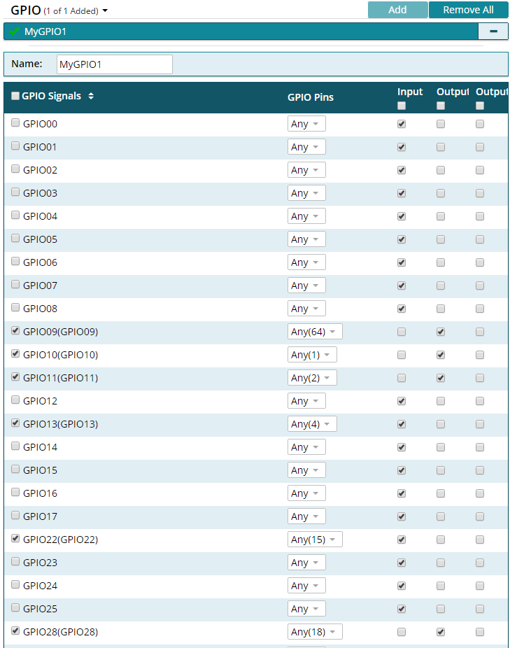
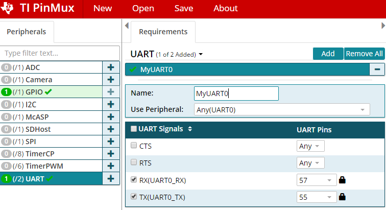
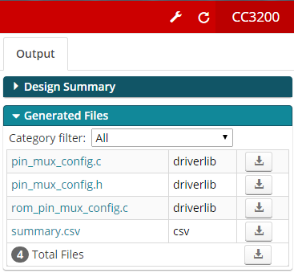
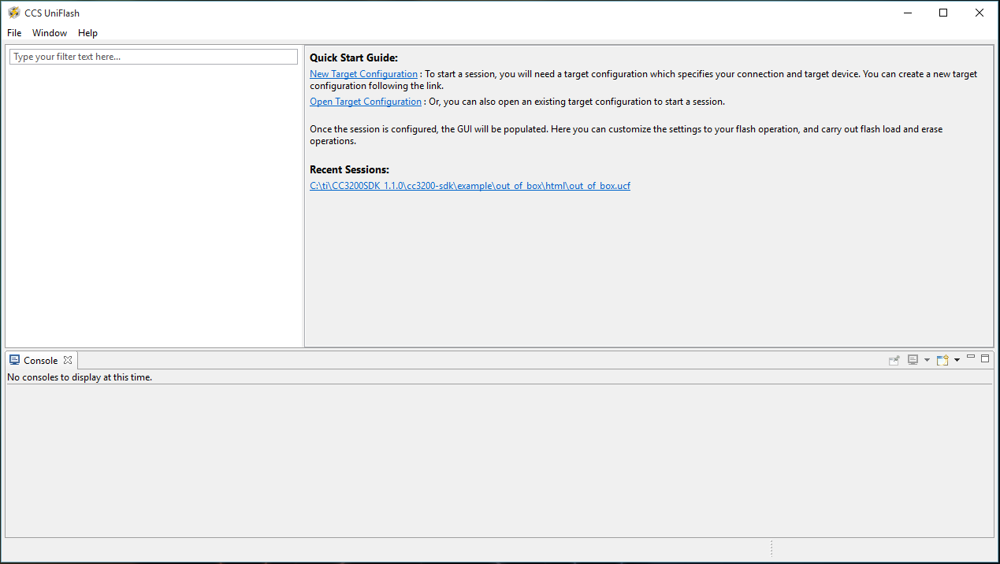
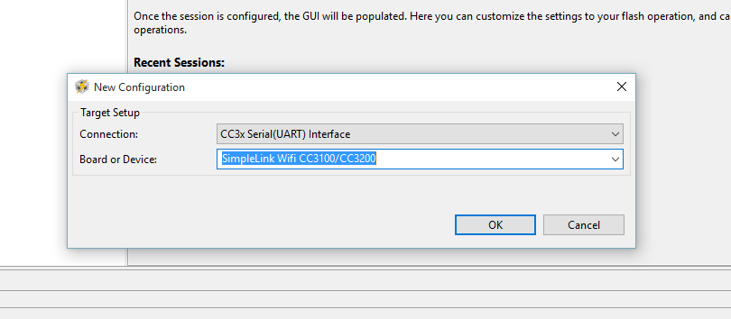
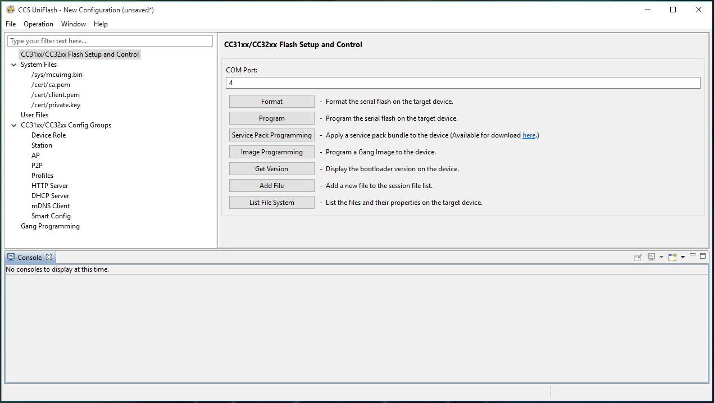
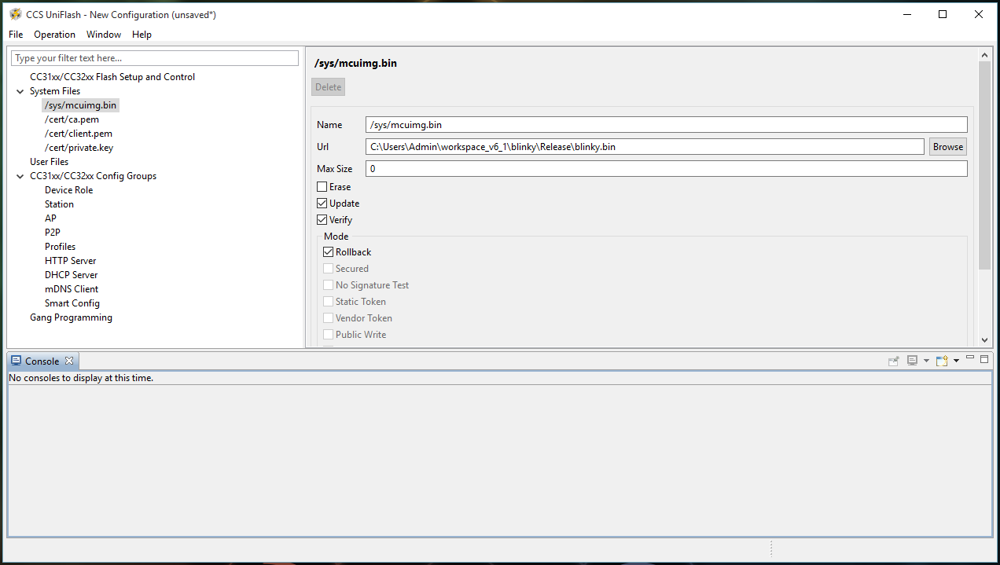
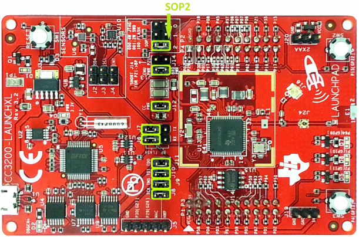

## Overview

This tutorial will cover the basic software development
tools that will be used in this course, including Code Composer Studio
(CCS), CCS UniFlash, and the TI Pin Mux Tool.

***This lab assignment is alotted 3 sections (1.5 week)
and verification is due by the end of your First lab section of week 2.***

## Learning Objectives

At the end of this lab, students should be able to:
- Know build and flash process for microcontrollers
- Use the CCS IDE on their local machine
- Set up new projects for the CC3200
- Configure build settings for CC3200 projects

## Requirements and Dependencies

### Hardware Requirements

- SimpleLink CC3200 LaunchPad (CC3200-LAUNCHXL)
- Micro-USB to USB-A cable

> **Note:** Do not lose the shorting/jumper blocks that come with the 
> board. They are used to configure different hardware functions on 
> the board, and may be needed for this and future labs.

### Software Dependencies

- Windows 10 or later
- Code Composer Studio (CSS) IDE [latest]
- CC3200 Software Development Kit [latest]
- CC3200SDK-ServicePack [latest]
- TI sysconfig tool [latest]
- CCS UniFlash [v3.4.1.x] or cc3200tool [latest]
- Terminal Emulator (e.g. PuTTY or TeraTerm)

> If you have not set up your software dependencies on your local machine,
> please do this first by following the [lab setup instructions](lab-setup.html).

## Background - Compiling and Flashing for Embedded Systems

As one of the course prerequisites is C programming, we will not spend
much time introducing the C programming language. However, it is 
important to have a solid grasps of the basic principles of compiling
C programs, and how programs are loaded (or flashed) onto
microcontrollers. 

### Compiling

***Compilation*** is the process of converting higher-level source code, 
such as C, into executable machine code. Typically, the ***C compilation 
process*** is made up of several steps. Usually, the source code first 
undergoes ***preprocessing***, then each `.c` file is individually 
***compiled***, or translated, into ***assembly*** and stored in an ***object 
file*** (`.o` file), which are finally ***linked*** together into an 
executable file format, such as ***ELF***. The elf file can then be 
converted into simpler formats, such as raw binary or Intel Hex, which
are more suitable for loading onto the microcontroller.

Because compilation can be time consuming, object files can be combined
into a single ***library file*** that is easier to move and manage. Instead
of passing all of the associated object files to the compiler, a single
library file can be passed instead. Note the difference between a
***static library*** and a ***dynamic library***. In the context of embedded 
systems, when we refer to a library, we usually mean a static library.

This is relevant to how CCS compiles projects. Rather than recompile
all of the SDK driver files, a driver library comes precompiled that 
the TI compiler can reference in the linking phase. Understanding the
linking process will help you debug issues related to static libraries.

### Flashing

***Flashing*** is a shorthand term for loading the compiled firmware onto 
hardware, typically into ***non-volatile memory***, such as ***flash memory***.
Occasionally, however, the firmware may be loaded into ***RAM*** for 
debugging purposes. Where the firmware gets located in the memory 
address space is determined by the linker script, and needs to be passed
to the tools used to upload the program into the MCU's memory.

Specific information on what happens during the flashing process depends
upon a number of factors, such as hardware organization and memory map,
the presence of an operating system, and the underlying processor 
architecture; however, much of this is out of scope for this course.

For this class, since we are using the CC3200, we can only flash using
TI's UniFlash tool, as CCS will only load the program into RAM for 
debugging. To program either RAM or Flash, the CC3200 Launchpad 
must have the SOP2 Jumper on before it is connected to the computer. If 
the SOP2 Jumper is not connected, the CC3200 will automatically try to 
boot from flash memory before the computer can connect to it. 

---

## Part I: Testing Examples in Code Composer Studio

In this part, you will create a workspace and import two example
programs to test with your CC3200 processor.

> **Note**: When you work on a lab PC, you should always save your work
> on a remote device before you leave. Do ***not*** count on your files
> remaining on the drive of the lab PC. We highly recommend using GitHub
> to backup your work regularly.

### Blinky Example

1.  Lauch Code Composer Studio (CCS) from the desktop icon or from the
    Start Menu.
    - CCS will prompt you to select a directory for your workspace. 
      Enter a directory in your user space, such as:
      
      **`C:\Users\\*your_name*\eec172\lab\ccs_workspace`**


    > Do ***<u>NOT</u>*** check the box “Use this as the default and do 
    > not ask again” on any of the lab machines since these machines 
    > will be shared among many users. Even on your own machine, we 
    > recommend that you avoid this option.

2.  Select **Import Project** from the Getting Started page, or 
    Right-Click in the Project Explorer and go to 
    `Import -> CCS Projects`

    1.  Choose **Select search-directory** and enter the cc3200sdk path.
        This may also be found using the **Browse** option. If the default
        install location was used, it should be:
        **`C:\ti\CC3200SDK_1.5.0\cc3200sdk`**

    2.  Select the `blinky` project and click **Finish**.

3.  In Project Explorer, right-click on `blinky` and select
    **Properties**. Ensure that the **Compiler version** is set to 
    `TI v20.x.x.LTS`. 

    While you are here, you should explore other properties to 
    familiarize yourself with the interface. For example, expand **ARM 
    Linker** and select **Basic Options** in order to see the default 
    heap and stack sizes for this project. When you are done examining
    project properties, click **Cancel** if you made no changes, or 
    **Apply and Close** if you needed to update the compiler version.

4.  Build the `blinky` project. This can be done in a number of ways:
    - Click the hammer icon while the `blinky` project is selected.
    - Select **Project \> Build Project** while the `blinky` project
      is selected.
    - Right-Click the `blinky` project and select **Build Project** 

    The project should build without any errors or warnings. If you 
    encounter errors, first attempt to solve them by referring to the
    console output log and exercising your Google-Fu to search for 
    solutions. If nothing seems to work, then ask the TA if you are 
    still experiencing the problem.

5.  Connect the CC3200 LaunchPad to your host computer using the
    supplied USB cable.

6.  Click the bug icon or select **Run \> Debug** to lauch the Debug
    Perspective. 
   
    (Following paragraph is mainly for MAC user, if you don't have this problem, ignore it and go 7.)
    
    The first time you attempt to run a program on the
    CC3200, you will get the following message:

    > **You require a target configuration to start a debug session. 
    > Do you want to create a new target configuration file and open it
    > in the editor?**

    Click **Yes**, then give the new Target Configuration file a name,
    such as `cc3200.ccxml`.

    Click the box “**Use shared location**” so that this configuration
    file can be used for all of your projects in this workspace. Then 
    click **Finish**.

    For the Connection, select **Stellaris In-Circuit Debug Interface** 
    and select the box for “**CC3200**” for the board or device. Then 
    scroll to the right of the window and select **Save**. 

    You should now see `cc3200.ccxml` listed under the `User Defined` 
    folder in the "Target Configurations" window. Make sure that 
    `cc3200.ccxml` is selected as the **default** target configuration. 
    Close the `cc3200.ccxml` window and click the bug icon or 
    **Run \> Debug** again. When running in debug mode, 
    your program will be loaded into the CC3200’s RAM. (Make sure that 
    the LaunchPad is still connected to the PC via the USB cable.)

7.  Click on the green “**Play**” button icon or select 
    **Run \> Resume** or type **F8** to run the program. 
    You should see the red, yellow and green LEDs blink in a continuous 
    sequence. Examine the program to see how it works.

---

### *Lab Checkoff Task 1*

**Make a simple modification to make the LEDs blink faster than in the
default program. For example, you can easily make the LEDs blink two
times to ten times faster with simple code modifications. Upload (Debug) the 
code again and verify that the program works as expected.**

**Demonstrate the modification to your TA to receive checkoff.
You may continue to the next part in the meantime.**

---

### Uart Demo Example

1.  Follow steps 1 and 2 above to import the **uart_demo** project. Build 
    the firmware as you did for `blinky` project, then upload the project
    via **Debug** on CCS. Do *not* hit the **Play** button yet. 

2.  Open a serial terminal window to connect to the CC3200 via UART.

    -   **Windows**: PuTTY or TeraTerm

        1.  To determine which COM port to connect to, open **Windows Device
            Manager** (`Start Menu -> Windows System -> Control Panel 
            -> Hardware and Sound -> Device Manager`) and expand 
            **Ports (COM & LPT)**. Note which COM Port corresponds to the 
            CC3200.

        2.  Configure terminal emulator with the corresponding COM port and
            set the baud rate to 115200

        Alternatively, in CCS itself:

        1.  Go to `View -> Terminal` and click the small `Open a Terminal`
            Icon.

        2.  Click the dropdown and select `Serial Terminal`.

        3.  Choose the right COM port, and hit `OK`

    -   **MacOS**: cc3200tool in Terminal

        1.  Open Terminal, then enter the following commands:

            ```console
            conda activate cc3200
            cc3200tool term 115200
            ```

        2.  Use `Ctrl+B` to stop the terminal.

        > **Note**: This assumes you have followed the install instructions
        > for MacOS and installed cc3200tool in the cc3200 conda environment

3.  Once your terminal window is open, run the `uart_demo` program in 
    the CCS Debug window. Verify that the program echoes text that you 
    type into the terminal window using the keyboard.

---

## Part II: Lab1 Application Program Exercise

In this part, you will develop a simple program that interfaces to a
console window and to switches and LEDs on the CC3200 LaunchPad. You
will also configure a signal on the P2 header as a general purpose
output that you will control based on the switch inputs and verify on an
oscilloscope. The complete program specifications will be presented
later.

1.  **<u>Create a project in CCS</u>**

    Instead of creating a new, empty project, it is easier to import an
    example project from the CC3200SDK and modify that project 
    according to the new project specs. In this case, we recommend that 
    you start with the `blinky` project since it is similar to the new 
    project you will develop. Note that you cannot import `blinky` into 
    your project when it is already there. However, you can rename the
    existing `blinky` project to a new name, such as `lab1-pt1`. This 
    way, you could re-import the original `blinky` project into your 
    workspace, if desired.

2.  **<u>Configure the pins for your project using the TI SysConfig
    Tool</u>**

    The *TI SysConfig tool* (formerly the TI Pin Mux tool) is a utility 
    used to select the appropriate pin multiplexing configuration to 
    satisfy the application requirements. 

    This tool makes it easy to understand the various pin configuration 
    options and to implement your desired pin configuration without 
    error. You can use either the Cloud-hosted Pin Mux Utility or the 
    stand-alone desktop SysConfig tool. 

    For the purposes of this lab, the instructions will be for the 
    desktop SysConfig tool. For information on using the TI Cloud-hosted
    tool, [refer to this video](https://www.youtube.com/watch?v=Q8yby_i3N_M).

    1.  Launch the TI SysConfig Tool from either the Start menu or the desktop
        icon, if it exists. Select **CC3200** as the device and click on the
        **Start** button.

    2.  We will first configure the desired GPIO signals. For this 
        project, we want to interface to the following devices/pins on 
        the CC3200 LaunchPad: Red, Yellow and Green LEDs, SW2 and SW3, 
        P18 on the P2 header, and the UART Rx and Tx pins which 
        interface to the console window. To determine which pins or GPIO
        signals you need to specify, consult the LaunchPad schematic 
        (CC3200-LAUNCHXL_SCH_Rev4p1-a.pdf) available on the course 
        website. 

        **Note:** <u>Make sure that you can verify the following signal
        names and pin numbers on the schematic</u>. (It will be very 
        important that you consult this schematic when deciding which 
        pins to use for hardware interfacing. Many of the pins that 
        are brought to the headers are already being used on the 
        LaunchPad board and are not actually available for general 
        use.)

        | Signal Name | Pin Number | Device           |
        |-------------|------------|------------------|
        | GPIO_9      | 64         | Red LED          |
        | GPIO_10     | 1          | Yellow LED       |
        | GPIO_11     | 2          | Green LED        |
        | GPIO_13     | 4          | SW3              |
        | GPIO_22     | 15         | SW2              |
        | GPIO_28     | 18         | P18 on P2 header |

    3.  Select the **GPIO** peripheral in the **Peripherals** tab on the
        left.

    4.  Click on the **Add** button in the Requirements tab so that you 
        can add GPIO signals.

    5.  Unselect all the GPIO signals by unchecking the box labeled 
        **Signals**; then, add the GPIO signals that you want to use
        in your project by checking the corresponding box and choosing
        the pin number from the dropdown box in the middle column.

    6.  Select the I/O mode (Input, Output or Output OD (Open Drain)) 
        for each of your signals from dropdown menu in the right-side 
        column. In this design, the switches should drive input pins 
        and outputs signals (*not* open drain outputs) will drive the 
        LEDs and P18.

    7.  Verify that the pin numbers match the ones in the table above. 
        If they don’t match, use the pull-down option to select the 
        correct pin number. Your GPIO section should look like the 
        following screen-shot. (The name of the module is arbitrary.)

        <div class="fig">
            
            <span class="caption">PinMux Configuration of GPIO signals</span>
        </div>

    8.  Next configure the UART peripheral. Note that you will need to 
        configure the UART0_RX to pin number 57 and UART0_TX to pin 
        number 55 as these are not the default pin assignments for these
        signals on the CC3200 LaunchPad. The lock icon shows that you 
        have locked that pin number to the specified signal. For 
        details, see the UART MUXING and the EMULATION sub-circuits on 
        the CC3200 LaunchPad schematic. Your UART configuration should 
        look similar to the screen-shot below.

        | Signal Name | Pin Number | Device  |
        |-------------|------------|---------|
        | UART0_RX    | 57         | FTDI_TX |
        | UART0_TX    | 55         | FTDI_RX |

        <div class="fig">
            
            <span class="caption">PinMux Configuration of UART signals</span>
        </div>

    9.  Save your configuration to a different location from your
        project directory. For example, you can use the name `lab1` and 
        the file will be stored as `lab1.syscfg`. You can open this file 
        later with the SysConfig Tool to change your pin configuration 
        instead of starting over.

    10. Save `pin_mux_config.c` and `pin_mux_config.h` to your project 
        directory by clicking on the adjacent download/save button and 
        navigating to the appropriate workspace directory.

    11. Remove the old `pinmux.c` and `pinmux.h` files from your project
        directory. In `main.c`, modify the `\#include` to use 
        `pin_mux_config.h` instead of `pinmux.h`.

        <div class="fig">
            
            <span class="caption">SysConfig Downloadable Output Files</span>
        </div>

---

### *Lab Checkoff Task 2*

**Modify your program code to meet the application specifications:**

1.  When your program starts, it should display a message on the console
    window (i.e. TeraTerm or other terminal emulator) with a header and
    usage instructions as shown below. A good example project to look at
    for basic UART functions is `uart_demo` in the CC3200SDK examples
    folder.

    ```
    ****************************************************
    
    CC3200 GPIO Application
    
    ****************************************************
    
    ****************************************************
    
    Push SW3 to start LED binary counting
    
    Push SW2 to blink LEDs on and off
    
    ****************************************************
    ```

2.  Your program should poll the SW3 and SW2 switches on the CC3200
    LaunchPad. When SW3 is pressed, you should start a binary counting
    sequence on the LEDs, counting from 000 – 111 *continuously* on the
    three LEDs. The count should be relatively slow so that you can see
    each count value easily. You should also print a message to the
    console “SW3 pressed”. This message should not be printed again
    until after SW2 has been pressed.

3.  When SW2 is pressed, your program should blink the LEDs ON and OFF 
    in unison. Again, the blink pattern should be relatively slow so 
    that you can see each pattern clearly and easily. You should print 
    the message “SW2 pressed” to the console. This message should not be
    printed again until after SW3 has been pressed.

4.  Set the output signal P18 high whenever SW2 is pressed and low
    whenever SW3 is pressed. You can verify this signal using an
    oscilloscope.

> NOTE: For polling the switches and controlling the outputs, you can
> use CC3200 Peripheral Driver Library APIs such as GPIOPinRead() and
> GPIOPinWrite(). The CC3200 Peripheral Driver Library User’s Guide can
> be found at
>
> <http://software-dl.ti.com/ecs/cc31xx/APIs/public/cc32xx_peripherals/latest/html/index.html>
>
> Verify your program using the CCS Debug mode.

**Demonstrate your application to your TA to receive checkoff.
You may continue to the next part in the meantime.**

---

## Part III: Programming Flash Memory

In this part, you will learn how to program the external flash memory so
that the program will remain in non-volatile memory through power
cycles. This section will demonstrate how to load the ***Part II***
program onto the external flash device on the CC3200 LaunchPad.

### Windows: CCS UniFlash

1.  On launching the UniFlash tool, you will see a window as shown 
    below. To start, click on the *New Target Configuration* link under 
    the **Quick Start Guide** heading, or under the 
    `File \> New Configuration` on the menu bar. This should open up the
    new configuration window.

    <div class="fig">
        
        <span class="caption">Launch Screen of the CCS UniFlash tool</span>
    </div>

2.  From the Connection drop down menu, select the ‘**CC3x Serial(UART)
    Interface**’ option, and the ‘**SimpleLink Wifi CC3100/CC3200**’ for
    the Board or Device in the screen-shot below. After the selections 
    are made, click **OK**.

    <div class="fig">
        
        <span class="caption">New Configuration Window</span>
    </div>

3.  This will open up the main screen shown below. First, the correct 
    COM Port for the device must be identified to the UniFlash tool. If 
    you are unsure of which COM Port to use, plug in the CC3200 
    Launchpad and open up the Device Manager to check. In this example, 
    the CC3200 Launcpad was on COM Port 4. Enter the COM Port number 
    into the text box, and then select the `/sys/mcuimg.bin` option on 
    **System Files** on the left of the screen.

    <div class="fig">
        
        <span class="caption"> CCS UniFlash Flash Setup and Control Screen</span>
    </div>

4.  This panel will allow you to identify the compiled `.bin` file that 
    will be loaded into the flash memory. Click on the **Browse** button 
    next to the **Url** text box, and locate the `.bin` file that you 
    would like to load into flash. For this example, the compiled 
    `blinky` example, `blinky.bin`, was selected from the CCS workspace.
    In addition, make sure the **Update**, and **Verify** check boxes 
    are selected. The UniFlash tool should now be ready to flash the 
    CC3200 LaunchPad hardware. If you find that the code is not being flashed. Try check **Erase**

    <div class="fig">
        
        <span class="caption">System File Options Screen</span>
    </div>

5.  Before connecting the CC3200 Launchpad to the computer, a jumper 
    will need to be placed on **SOP2** as shown below. This will allow 
    the flash memory to be programmed by CCS UniFlash, and will prevent 
    the previously flashed program from being executed.

    <div class="fig">
        
        <span class="caption">
            <p>
                Minimum Jumper Configuration for Flashing the CC3200
                <br>
                Source: Figure 1 of the <em>CC3200 SimpleLink Wi-Fi and IoT 
                Solution With MCU LaunchPad Getting Started Guide</em>
            </p>
        </span>
    </div>

6.  Once you have verified the jumpers are correctly set, connect the
    Launchpad to the computer, and return to the **Flash Setup and 
    Control** panel that was shown earlier and click the **Program** 
    button. This should successfully program the board. 

    To see the program run, disconnect the Launchpad from the computer,
    remove the SOP2 jumper, then reconnect the board to the computer. 

    > Do not lose the jumper since you will often need to use it.

    The `blinky.bin` file should now run at launch instead of the out of
    the box demo program (or whatever program was previously programmed 
    in flash). If this does not work, double check that the necessary 
    jumpers are placed on the Launchpad and that the options on the 
    `/sys/mcuimg.bin` panel are set correctly.

### MacOS: cc3200tool

1.  Open a Terminal and navigate to the folder where your `blinky.bin`
    file is saved. Then run the following commands:

    ```bash
    conda activate cc3200
    cc3200tool --sop2 \~dtr --reset prompt \
        format_flash --size 1M \
        write_file blinky.bin /sys/mcuimg.bin
    ```

    Follow the prompts that the tool prints to the console. 
    Here is a sample of what you should see:

    ```console
    // testing
    $ cc3200tool --sop2 \~dtr --reset prompt \
    format_flash --size 1M \
    write_file uart_demo.bin /sys/mcuimg.bin
    2024-01-09 22:52:37,850 -- Connecting to target...
    Reset the device with SOP2 asserted and press Enter

    2024-01-09 22:52:45,141 -- Connected, reading version...
    2024-01-09 22:52:45,156 -- connected to target
    2024-01-09 22:52:45,156 -- Version: CC3x00VersionInfo((0, 4, 1, 2), (0, 0, 0, 0), (0, 0, 0, 0), (0, 0, 0, 0), (16, 0, 0, 0))
    2024-01-09 22:52:45,156 -- This is a CC3200 device
    2024-01-09 22:52:45,156 -- Switching to NWP bootloader...
    2024-01-09 22:52:45,170 -- Switching UART to APPS...
    2024-01-09 22:52:45,181 -- Resetting communications ...
    2024-01-09 22:52:48,422 -- timed out while waiting for ack
    2024-01-09 22:52:48,679 -- Uploading rbtl3100s.dll...
    2024-01-09 22:52:48,683 -- Getting storage list...
    2024-01-09 22:52:49,721 -- APPS version: CC3x00VersionInfo((0, 4, 0, 2), (0, 0, 0, 0), (0, 0, 0, 0), (0, 0, 0, 0), (16, 0, 0, 0))
    2024-01-09 22:52:49,721 -- Formatting flash with size=1024
    2024-01-09 22:52:50,746 -- Uploading file uart_demo.bin -> /sys/mcuimg.bin [13408, disk=13408]...
    ....
    2024-01-09 22:52:51,243 -- Getting storage info...
    2024-01-09 22:52:51,255 -- storage #2 info bytes: 0x10, 0x0, 0x1, 0x0, 0x0, 0x0, 0x0, 0x0
    2024-01-09 22:52:51,255 -- Getting storage list...
    2024-01-09 22:52:51,282 -- Reading raw storage #2 start 0x0, size 0x2000...
    ................................
    2024-01-09 22:52:51,819 -- [1] detected a valid FAT revision: 3
    2024-01-09 22:52:51,819 -- Getting storage list...
    2024-01-09 22:52:51,845 -- Reading raw storage #2 start 0x1774, size 0x2774...
    ........................................
    2024-01-09 22:52:52,501 -- selected FAT revision: 3 (active)
    2024-01-09 22:52:52,502 -- FAT r3, num files: 1, used/free blocks: 9/247
    2024-01-09 22:52:52,502 -- All commands done, bye.
    ```

> The `blinky.bin` file should be located in a subfolder of your project
> directory in your workspace. 


---

### *Lab Checkoff Task 3*

**Use the CCS UniFlash utility to program your application into the
on-board serial Flash chip.**

Once your application program from Part II works, load it into the
serial Flash chip on the CC3200 LaunchPad so that your program can run
without downloading the code from CCS into RAM in Debug Mode.

To test your program, power the LaunchPad by connecting the USB cable
to a host PC. Then open a terminal window using TeraTerm or PuTTY on
the appropriate COM port. To see your header message, press the Reset
button on the LaunchPad to restart your application program.

**Demonstrate your working program to your TA to receive checkoff**


