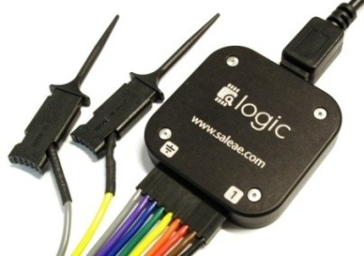
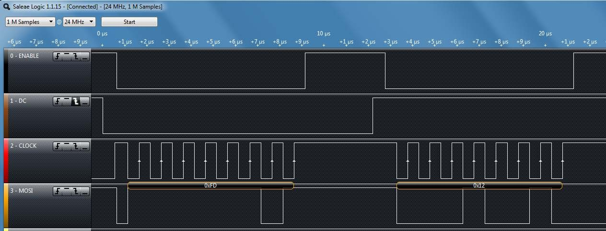
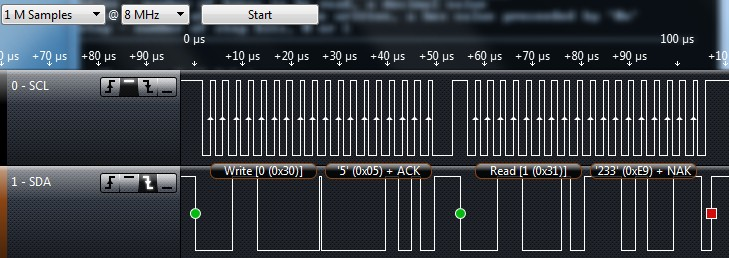

## Overview

In this lab, you will use SPI to interface the CC3200 LaunchPad to a color 
OLED display. You will also use I2C to communicate with an on-board 
Bosch BMA222 acceleration sensor. Your application program will detect the 
XY tilt of your board based on BMA222 readings and use the tilt to control 
an icon on your OLED display. You will also use a Saleae logic probe to 
capture and display SPI and I2C signal waveforms.

***This lab assignment is alotted 4 sections (2 weeks)
and verification is due by the end of your First lab section of week 4.***

## Learning Objectives

At the end of this lab, students should be able to:
- Describe the connection topology of SPI and I2C devices
- Describe at a high level the protocol state machine for SPI and I2C
- Connect and configure SPI and I2C-based peripherals with a microcontroller
- Write code to interface a MCU with SPI and I2C devices
- Configure a logic analyzer for observing digital signals

## Requirements and Dependencies

### Hardware Requirements

- 2 Adafruit OLED Breakout Board - 16-bit Color 1.5" (product id: 1431)
 on small breadboards
- 1 Saleae USB Logic Analyzer Jumper wires
- (Optional) USB Flash Drive for saving code

> **Note:** Do not lose the shorting blocks (jumpers) that come with the
> board. They are used to configure different hardware functions on the
> board, and may be needed for this and future labs. Unused shorting
> blocks should be kept on the board attached to a single header pin.

### Software Requirements

- CCS
- Saleae Logic 2 Software
- (Recommended) Git and GitHub<sup>1</sup>

> [1]: We highly recommend using Git and GitHub for source code version
> control starting with this lab. If you are unfamiliar with git and 
> GitHub, you can learn more about it from [this youtube video](https://www.youtube.com/watch?v=tRZGeaHPoaw)

### Lab Datasheets

Refer to the following technical documents, which should be posted on
the course website:

- CC3200 Technical Reference Manual
- CC3200 LaunchPad User Guide
- CC3200 LaunchPad Schematic
- CC3200 Datasheet
- SSD1351 128 RGB x 128 Dot Matrix OLED/Common Driver with Controller
  Advance Information
- OLED Display Module Product Specification (Doc No. SAS1-D038-A)
- Bosch BMA222 Data sheet (Accelerometer)

## Prelab - Synchronous Serial Protocols

Synchronous serial protocols, particularly SPI and I2C are ubiquitous in
embedded systems. They are the primary mode of communication between the
microcontroller and the subsystems it controls. Spending time to gain an
in-depth understanding of these protocols is a valuable effort, as it
will help you greatly when debugging communications between components
in your systems. A short primer on the topics follows to give you
a high-level overview, but is by no means comprehensive.

### SPI

***Serial Peripheral Interface (SPI)*** is a 3 or 4 wire communication 
protocol designed for high-speed, high-throughput connections. 
Commonly, the 4 signals in SPI are ***COPI***, ***CIPO***, ***SCLK***, and
***CS***. COPI and CIPO are often also referred to as MOSI and MISO.
SPI is a ***full-duplex*** communication protocol, where the controller 
sends data to the peripheral on the COPI line, and simultaneously 
receives data on the CIPO line. The communication speed is determined 
by the SCLK signal's frequency, generated by the controller. 

SPI can support multiple devices on a shared bus, where a single 
controller can communicate with many peripherals. There are 2 wiring 
configurations that are commonly used to accomplish this: the ***Star 
Topology*** and the ***Daisy Chain Topology***. 

### I2C

***Inter-Integrated Circuit (I2C)*** protocol is a 2-wire communication
protocol designed for simple hardware configuration and flexibility.
The 2 signals of relevance in I2C are ***SDA*** and ***SCK***. I2C is a
***half-duplex*** communication protocol, where the controller initiates
communication with the peripheral and indicates whether the operation is
a write to the peripheral or a read from it. Regardless, like SPI, 
the communications are synchronized by the clock signal that the 
controller generates.

I2C can also support multiple devices on a shared bus, and can even 
support multiple controllers with multiple peripherals, with additional
constraints on the protocol steps.

---

### *Prelab Checkoff Task*

The prelab is a set of 6 questions designed to prepare you concpetually
for the lab. The assignment is graded on completion and expected to take no 
more than an hour at most to finish.

**Please bring a completed copy of the Lab 2 Prelab Assignment 
(posted on Canvas) and show your TA at the beginning of lab for
verification.**

---

## Part I: Controlling the OLED via Serial Peripheral Interface (SPI)

In this part, you will interface to the 128x128 color organic
light-emitting diode (OLED) display to the CC3200 LaunchPad using SPI.

### Running `spi_demo` on two CC3200 LaunchPads

As a starting point, you should study, import, build, and test the
`spi_demo` project on two CC3200 LaunchPads. The project is documented
on TI's website [here](https://software-dl.ti.com/ecs/CC3200SDK/1_5_0/exports/cc3200-sdk/example/spi_demo/README.html).

In this demo, one launchpad will be programmed as the SPI controller,
and the other as the peripheral. Since they must both be programmed, 
and CCS will not allow you to connect to multiple devices from the same
instance and workspace, you have a few options:

- Program each launchpad from a separate computer
- Flash one launchpad with uniflash before running the other on CCS
- Launching 2 instances of CCS with **different workspaces** and 
  connecting to separate devices.

When programming the SPI controller board, you should set `MASTER_MODE` 
to `1` in `main.c`:

```c
#define MASTER_MODE 1
```

For the SPI peripheral board, you should set `MASTER_MODE` to `0`:

```c
#define MASTER_MODE 0
```

The TI documentation describes the wiring between the two LaunchPad
boards. Each LaunchPad will also connect to its own serial terminal 
window.

Note that you can use a single host computer running two instances of
CCS and two serial terminals or you could have each LaunchPad
connected to a separate computer. As described in the documentation:

> Always execute master application followed by slave application to
> avoid slave SPI receiving garbage.


### Implement OLED interface using SPI

For the SPI interface to the OLED, you will need to use the interface
signals shown in the table below. 

Note that you will use **GPIO** signals configured as outputs to control
the *DC* (Data/Command), the *OLEDCS* (OC) and the *RESET* signals on 
the OLED. You can choose any unused GPIO signals on the LaunchPad 
headers `P1` or `P2`. However, check the LaunchPad schematic to verify 
that the signals are truly available. For example, the GPIO on `P2.9` 
(Dev Pin #55) is the `UART0_TX` signal and is not available for GPIO 
when the console window is used. 

Additionally Do not use the LaunchPad’s `RESET_OUT` signal for the OLED 
`RESET` since you should be able to reset the OLED independently from 
the CC3200 LaunchPad.

> **Note:** We are using a GPIO signal to control the `OLEDCS` instead 
> of the dedicated `SPI_CS` signal because we plan multiple SPI devices 
> on the CC3200’s general-purpose SPI port.

> **Note:** You should be using the TI SysConfig Tool to enable the SPI,
> UART, and GPIO peripherals. Remember to uncheck CTS and RTS under the 
> UART module, and configure the GPIO input/output setting. You will not 
> need Output OD (open drain)

<table align="center">
<colgroup>
<col style="width: 45%" />
<col style="width: 54%" />
</colgroup>
<thead>
<tr class="header">
<th><strong>OLED signal</strong>
</th>
<th><strong>LaunchPad interface</strong></th>
</tr>
</thead>
<tbody>
<tr class="odd">
<td>MOSI (SI)</td>
<td>SPI_DOUT ( MOSI)</td>
</tr>
<tr class="even">
<td>SCK (CL)</td>
<td>SPI_CLK (SCLK)</td>
</tr>
<tr class="odd">
<td>DC</td>
<td>GPIO</td>
</tr>
<tr class="even">
<td>RESET (R)</td>
<td>GPIO</td>
</tr>
<tr class="odd">
<td>OLEDCS (OC)</td>
<td>GPIO</td>
</tr>
<tr class="even">
<td>SDCS (SC)</td>
<td>n.c. (no connection)</td>
</tr>
<tr class="odd">
<td>MISO (SO)</td>
<td>n.c. (no connection)</td>
</tr>
<tr class="even">
<td>CD</td>
<td>n.c. (no connection)</td>
</tr>
<tr class="odd">
<td>3V</td>
<td>n.c. (no connection)</td>
</tr>
<tr class="even">
<td>Vin (+)</td>
<td>3.3V</td>
</tr>
<tr class="odd">
<td>GND (G)</td>
<td>GND</td>
</tr>
</tbody>
</table>

Adafruit provides a [link](https://www.adafruit.com/product/1431) to an 
open source graphics library for this display. The code is written for 
Arduino so we need to port it to the CC3200. We will provide modified 
library functions with the Arduino-specific code removed or commented 
out. 

Your task will be to write the low-level functions `WriteData()` and 
`WriteCommand()`, which use the SPI port, to write a data or command 
byte to the OLED. You should study the SPI example program that you 
tested in Part 1. 

The `WriteData()` and `WriteCommand()` functions allow you to make use 
of the higher-level OLED library functions. Look for `TODO` comments
in the `Adafruit_OLED.c` and `test.c` files for specific tasks.

---

### *Lab Checkoff Task 1*

**Write a test program that mimics the Arduino example `test.ino` found 
on [github](https://github.com/adafruit/Adafruit-SSD1351-library/blob/master/examples/test/test.ino)**

**Your test program for the OLED display should do the following:**

- Print the full character-set found in the font table in `glcdfont.h`.
- Print the string “Hello world!” to the display
- Display a pattern of 8 bands of different colors *horizontally* across
  the full OLED display.
- Display a pattern of 8 bands of different colors *vertically* across
  the full OLED display.
- Call the `testlines()` function to display diagonal lines.
- Call the `testfastlines()` function to display a rectangular grid
  pattern.
- Call the `testdrawrects()` function to draw a pattern of rectangles.
- Call the `testfillrects()` function.
- Call the `testfillcircles()` and `testdrawcircles()` functions.
- Call the `testroundrects()` function.
- Call the `testtriangles()` function.

> **Note:** There should be a small delay between calling each of these 
> functions to allow each pattern to be clearly seen. Your program 
> should be an infinite loop that continually cycles through the 
> specified test patterns.

**Demonstrate the modification to your TA to receive checkoff.
You may continue to the next part in the meantime.**

---

### Verifying SPI waveforms using a Saleae logic

1.  To use the logic analyzer on your personal machine, you will need to
    install the *Logic 2* software. The link can be found on the 
    [lab setup page](lab-setup.html).
    <!-- (version 1.1.15) -->

    The Saleae User Guide can be found [online](https://support.saleae.com/user-guide)

    > **Note:** When plugging the wire harness into the logic analyzer 
    > pod, notice that the orientation is shown on the bottom of the pod.
    > **Make sure that the ground symbol on the bottom of the Saleae 
    > module is aligned with the grey wire.** Black is data Channel 0, 
    > Brown is Channel 1 and so on (the colors follow the color code for
    > resistor values). **You should make the signal connections with 
    > both the CC3200 LaunchPad and the Saleae logic probe *unpowered*!**

    

2.  The Saleae application includes various serial protocol analyzer,
    including SPI. Turn on the SPI analyzer. To configure the SPI
    analyzer, click on the gear icon and select Enable Settings from the
    menu options.

3.  Capture an SPI waveform using the Saleae logic probe for verification.
    **Use `Options > Save Screen Region` feature to save a picture of your 
    SPI waveforms for your lab report**. Another method is to take a 
    screenshot using the Windows Snipping Tool or `Cmd+Shift+4` on Mac to 
    capture the area on the screen. You will need to explain how the 
    waveform you captured is related to your software. An example
    screen-shot is shown below.

    

---

### *Lab Checkoff Task 2*

**Demonstrate to your TA that you captured the SPI waveform using the
Saleae logic program.** For this purpose, you should capture the very
first packets transmitted from the micro controller. To be more
specific, the first few lines of codes in the `Adafruit_Init` program
are the `WriteData()` and `WriteCommand()`, and the Data/Command is sent
through the SPI to the OLED board. **You should confirm these with your
code and explain how the captured waveform relates to these
instructions.**

**The captured SPI waveform should be included in your lab report with
a description of the data it contains and how it relates to the code you
wrote.**

---

## Part II: Controlling the BMA222 accelerometer with I2C

In this part, you will interface to the Bosch BMA222 accelerometer on
the CC3200 Launchpad using I2C. You will then write an
application program that uses the acceleration data to control a
graphical icon on your OLED.

### Running `i2c_demo` on the CC3200 LaunchPad

As a starting point, you should study, import, build, and test the
`i2c_demo` project on a CC3200 LaunchPad. The project is documented 
[here](https://software-dl.ti.com/ecs/CC3200SDK/1_5_0/exports/cc3200-sdk/example/i2c_demo/README.html).

In addition, you should study the Bosch BMA222 Data sheet to
understand how the acceleration sensor can be used. For example, the
acceleration data is described in Section 4.4.1 and includes the
following basic information:

> “The width of acceleration data is 8 bits given in two’s complement
> representation. The 8 bits for each axis are given in registers (`0x03`)
> `acc_x`, (`0x05`) `acc_y` and (`0x07`) `acc_z`.”

You can use the `i2c_demo` program to see what kinds of acceleration
data you get for various tilt angles using the readreg command as
shown below, where the BMA222 has I2C device address `0x18`.
The following three commands read the acceleration data for the x, y
and z axes, respectively.

```text
cmd# readreg 0x18 0x3 1 
cmd# readreg 0x18 0x5 1 
cmd# readreg 0x18 0x7 1
```

Another way to read the data is to read multiple bytes at once, such
as in the command below. This command will read the new data flag and
the acceleration data for the x, y and z axes, respectively.

```text
cmd# readreg 0x18 0x2 6
```

### Verifying I2C waveforms using a Saleae logic

Set up your Saleae logic probe to capture I2C waveforms by enabling the
I2C Analyzer. You will need to connect three wires: Ground, `I2C_SCL`, 
and `I2C_SDA`. 

To avoid damaging the electronics, you should always make the signal 
connections with both the CC3200 LaunchPad and the Saleae logic probe 
***unpowered***. As before, make sure that the ground symbol on the 
bottom of the Saleae module is aligned with the grey wire and connect 
the grey wire to one of the CC3200 GND pins. You can check the 
`pinmux.c` file in the `i2c_demo` project to find out which pins are 
used for `I2C_SCL` and `I2C_SDA`. Connect two of the Saleae probes, 
such as the Black and Brown leads, to the appropriate header pins.

**Double-check your ground and signal connections *before* you turn
on the power to the CC3200 LaunchPad.**

---

### *Lab Checkoff Task 3*

**Capture two I2C waveforms using the Saleae logic probe, one reading 
the x axis data and one reading the y axis data.
Explain which command was used to generate each waveform and how the
waveform corresponds to what you expect to see.**
An example screen-shot of an I2C waveform is shown below.



**Include images of both waveforms in your lab report.**

---

## Part III: Sliding Ball

In this part, you will use the accelerometer to move a small “ball” (a
filled circle icon) with a radius of about 4 pixels (± 2) around on
the OLED display. 

The accelerometer output can be used to determine the accelerometer 
*pitch* and *roll* orientation angles, which can be used to control the 
motion of the ball left, right, up and down. 

**Requirements:**
- Initially, you should display the ball at the center of your OLED
  display. When the CC3200 Launchpad is flat, the ball should be
  stationary on the display.

- Rotating the accelerometer around the x-axis (roll) should move the 
  ball left and right. The steeper the roll angle, the faster the ball 
  should scroll across the OLED display. 

- Rotating the accelerometer around the y-axis (pitch) will move the 
  ball up and down on the OLED display, where the speed of the ball
  should be proportional to the pitch angle. 

- When the ball reaches the edge of the OLED display, it should not move
  any further in that direction. That is, it should not scroll off the 
  screen, but should stop at any edge.

> **Note 1:** Since the Z measurement is not used, you can disable or 
> ignore the Z measurements.

> **Note 2:** You should be able to tilt the x and y axes simultaneously 
> to move the object in any arbitrary direction on the display. For 
> example, you should be able to move the object from the center 
> directly to any of the four corners. The tilt sensitivity should such
> that you can precisely control the position of your object, while
> still being able to quickly move larger distances if needed.

---

### *Lab Checkoff Task 4*

1.  **Demonstrate to your TA that you can move the ball up, down, left and
    right across the OLED display by tilting the CC3200 Launchpad
    accelerometer about the x and y axes. Show that you can move the
    ball from the center of the display to each corner of the display
    and then back to the center.**

2.  **Demonstrate that you can control the speed of the ball’s motion by
    changing the tilt angle about the x and y axes with the following 
    specifications:**

    - The ball should be at maximum speed when the tilt angle is 90 
      degrees (i.e. freefall). At maximum speed, it should take most 2 
      seconds to move the ball from one edge of the display to the other.

    - When the accelerometer is barely tilted, the ball should move very
      slowly. You should be able to precisely control the motion of the
      ball on the OLED display, stopping it at any location on the
      display. 

    - You should be able to move the ball at any arbitrary angle across 
      the OLED display.

---

## Lab Report

Refer to the [general lab report instructions](lab-report.html) for general
formatting and guidelines.

Your lab report should include:
- A soft-copy of your well-written, *well-commented* code for Task 4
  - Include your names in the header comments of the file containing your
    main program.
  - This can be a copy of the entire project directory (which you can export
    in CCS to a zip file by Right-Clicking the project name and selecting 
    `Export -> General -> Archive File` and specifying the location)
- A well-written PDF report that contains, in addition to the general 
  guidelines:
  - An image of an SPI waveform captured by your Saleae logic probe using the
    SPI protocol analyzer. *Explain how the waveform corresponds to the
    known lines of code in your program, as well as the SPI mode you used
    for the OLED interface and why you chose that mode.*
  - Two images of I2C waveforms captured by your Saleae logic probe using the
    I2C protocol analyzer. Explain how the waveforms correspond to the 
    commands or instructions that caused them.
  - A description of any noteworthy difficulties you encountered in 
    constructing your solution.
