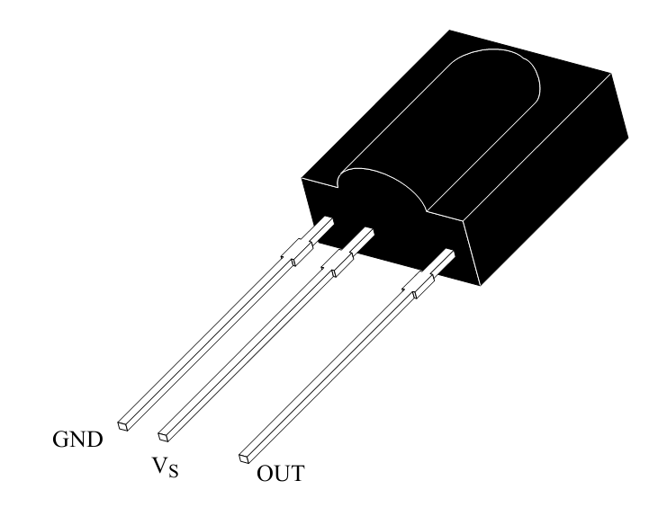
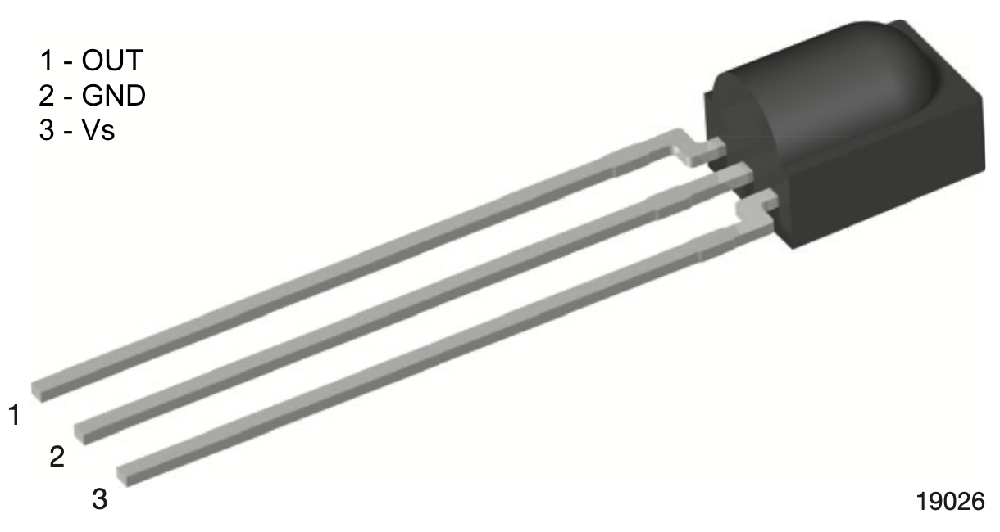
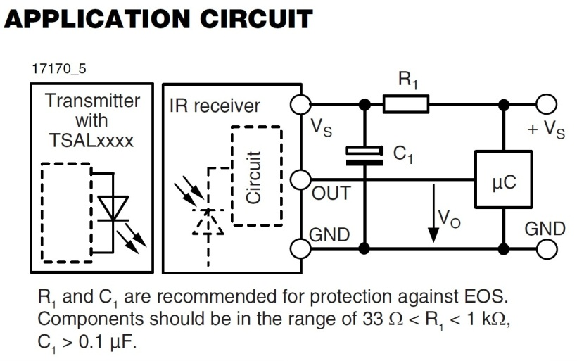
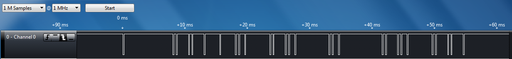
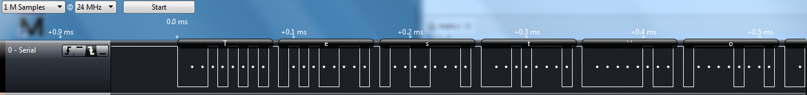

> Warning: This is a hard lab, which is why it's also the longest.
> We would highly recommend working on this outside of scheduled lab
> hours in order to finish this one on time, and emphasize
> that you need to read the relevant documentation and datasheets 
> mentioned in this lab manual, as you will not be able to complete
> this lab without a thorough understanding of them.

## Overview

In this lab, you will use the Saleae logic analyzer and an IR receiver 
module to characterize the transmissions for buttons from an AT&T IR 
universal remote control for a specific TV. 

Each group will be assigned a specific data format to decode that is
associated with a unique TV code. You will then connect the CC3200 
Launchpad to the IR receiver module and write a program that uses 
interrupts to monitor the signal from it. By analyzing the series of 
pulses, your program will be able to determine which button was pressed 
on the IR remote control. You will then use your IR remote control to 
compose text messages using the 
[multi-tap text entry system](https://en.wikipedia.org/wiki/Multi-tap) 
and send text messages back and forth between two CC3200 LaunchPad 
boards via UART channel.

***This lab assignment is alotted 6 sections (3 weeks)
and verification is due by the end of your last lab section of week 6.***

## Learning Objectives

At the end of this lab, students should be able to:
- Explain and Implement GPIO-based interrupts
- Understand and Construct the IR receiver circuit
- Implement digital signal decoding in software
- Configure UART communication between 2 CC3200 boards

## Requirements and Dependencies

### Hardware Requirements

- 2 AT&T S10-S3 Remotes
- 2 100Ω resistor
- 2 100μF capacitor
- 2 Vishay TSOP311xx/313xx/315xx or TSOP381xx/383xx/385xx

  

    
    TSOP311xx/313xx/315xx Module Package
  

  

    &nbsp;&nbsp;&nbsp;&nbsp;
  

  

    
    TSOP381xx/383xx/385xx Module Package
  

### Lab Datasheets

Refer to the following technical documents, which should be posted on
the course website:

- CC3200 Technical Reference Manual
- CC3200 LaunchPad User Guide
- CC3200 LaunchPad Schematic
- CC3200 Datasheet
- IR Receiver Modules for Remote Control Systems
- Data Formats for IR Remote Control
- AT&T IR Universal TV Remote User Guide
<!-- https://www.att.com/support_media/images/pdf/uverse/remote_control_user_guide.pdf -->

## Prelab - Interrupts, Systick, and the IR Receiver Circuit

Interrupts are a foundational concept for programming embedded systems.
As has been discussed in class, interrupts are extremely useful for 
managing I/O in an efficient and timely manner.

In this lab, you will need to use GPIO interrupts, as well as the 
SysTick module to decode the TV remote signal. Hence, you should use the 
prelab to focus on understanding *how interrupts work, how interrupt 
handlers should be written, concurrency and common concurrency
bugs, as well as the SysTick module*. For understanding the IR receiver
module, you should refer to the application circuit in its datasheet.

Though we include a primer, you *will* need to go deeper in order
to understand the topics on the prelab.

### Prelab Objectives

Students should be able to at minimum:
- recall how a GPIO interrupt can be triggered and what occurs in the firmware when that happens
- understand the function and applications of the `volatile` C keyword
- understand the Cortex-M SysTick peripheral
- recall the role of the resistor and capacitor in IR receiver connection circuit

ideally:
- identify firmware bugs common in implementing interrupt handlers
- debug the IR receiver/MCU system

### Interrupts

As already covered in class, **interrupts** allow a microcontroller to 
quickly respond to events without needing to poll the corresponding 
resource. An interrupt can be thought of as a specific hardware signal 
that is directly connected to the processor and associated with a 
particular resource. When signal changes, the processor knows that an
event has occured for the corresponding resource, and will react to it
by halting its current process and calling a special, designated function
called an **interrupt handler** (a.k.a. **Interrupt Service Routine** or 
**ISR**). Designating a function as a given peripheral's interrupt 
handler is usually done in source code and is often facilitated by 
defining the handler, then passing it to the peripheral's initialization
routine. Specific interfaces can vary.

It is important to note that interrupts are called *asynchronously*, so 
firmware that makes use of interrupt handlers are considered **concurrent**.
Concurrency, at a high level, is the idea that multiple programs can
be executed in a manner that looks simultaneous, but may actually have
*interleaved* semantics. Because of this, you cannot make assumptions about
the state of global variables if those variables are accessed in multiple
contexts.

Here some useful resources that give more insight onto how interrupts
work in general:

- [Intro to Microcontrollers - Interrupts](https://www.embeddedrelated.com/showarticle/469.php)
- [Intro to Microcontrollers - More on Interrupts](https://www.embeddedrelated.com/showarticle/472.php)
- [Embedded.fm Podcast - Ep. 224 Interrupts to Interrupt Interrupts](https://embedded.fm/episodes/224)
- [Embedded.fm Blog - ESE101 #23-25](https://embedded.fm/blog/ese101#:~:text=23.%20Interrupts,Blink%20A%20Light)

### SysTick Module

The **SysTick** peripheral module is a *system peripheral* of 
Cortex-M processors. It is essentially comprised of a counter register 
that is tied to the system clock, as well as a few status and 
configuration registers that hold the counter's reset value among other
things.

---

### *Prelab Checkoff Task*

The prelab is a set of 6 questions designed to prepare you concpetually
for the lab. The assignment is graded on completion and expected to take no 
more than an hour at most to finish.

**Please bring a completed copy of the Lab 3 Prelab Assignment 
(posted on Canvas) and show your TA at the beginning of lab for
verification.**

---

## Part I: IR Receiver and Remote Setup

### IR Receiver Module Setup

The figure below shows the connection schematic for the IR module.

  
  Application Circuit using the Vishay 
  TSOP313xx/TSOP381xx IR Receiver Module (taken from datasheet)

The module has three pins: 
  - power (Vs)
  - ground (GND)
  - output signal (OUT)

**NOTE: Different IR modules have different pinouts!!** Double check 
which IR module you have before making connections.

The resistor and capacitor R1 and C1 are meant to
filter noise that might occur on the power source and to protect against
electrical over-stress (EOS) from power supply variations. Vs can be set
to +3.3V and you can use R1 = ~100Ω and C1 =
~100μF. Because the IR receiver draws very little current, you can power
it directly from your processor board.

*Before connecting the IR receiver to your processor*, you should wire it
up and connect the OUT signal to an oscilloscope or the Saleae logic
probe (See Part 2). You will first collect waveform data with the Saleae
module, before you interface the device to your Launchpad. When you do 
interface the IR receiver to your processor, you will connect the OUT
signal to an available GPIO input signal.

You should read through the TSOP31336 IR Receiver Module datasheet to
understand how the module works. As shown in the Block Diagram of the
datasheet, the IR receiver has a band-pass filter, which has a center
frequency of 36 kHz. 

> Note 1: The TSOP31336 is able to suppress most of the interference from
> fluorescent lights. By using an oscilloscope, you can check if there 
> are any spurious pulses on the OUT pin due to the fluorescent lights
> when there is no input signal from the remote. The lights in lab 
> typically do not generate noise on the device, but outside of lab you
> may need to shield your receiver from the lights. 

> Note 2: When in the lab around other groups, you may need to shield 
> your receiver from other groups’ IR remotes.

### TV Remote Configuration

Your remote may have been previously configured so you should first
reset the remote to factory defaults as follows:

1.  Press and hold the **AT&T** key along with the **OK** key. Hold
    both keys for one second, then release. All the mode keys should
    flash twice.

2.  Enter **900** using the numeric keypad. The AT&T key will give a
    long flash to confirm success.

3.  If the remote control times-out before you complete the procedure,
    you will need to start over.

By default, the backlight is set to ON. You should disable
backlighting to extend battery life. To toggle the backlight setting
from ON to OFF (or vice versa), use the following steps.

1.  Press and hold the **AT&T** key along with the **OK** key. Hold
    both keys for one second, then release. All the mode keys should
    flash twice.

2.  Enter **991** using the numeric keypad. The AT&T key will give a
    long flash to confirm success.

You will program a Device code for a specific TV, as assigned by your
TA. A TV Device code is a 4-digit number that must start with “1”. The
IR transmission encoding for a specific TV varies by manufacturer and
TV model so there are different Device codes for different TVs.

1.  Press and hold the **TV** key along with the **OK** key. Hold both
    keys for one second, then release. All the mode keys should flash
    twice to indicate that you are in the programming mode.

2.  Enter the 4-digit Device Code using the numeric keypad.

3.  The TV key will give a long flash to confirm success.

Next you will configure the remote so that Channel and Volume commands
always control one device, namely, the TV that you just specified. For
channel control using the numeric keypad to be sent to your TV ,
perform the following steps:

1.  Press and hold the **AT&T** key along with the **OK** key. Hold
    both keys for one second, then release. All the mode keys should
    flash twice.

2.  Enter **966** using the numeric keypad. The AT&T key will flash
    twice to confirm success.

3.  Press the **TV** key. The TV key will give a long flash to confirm
    success.

For volume control commands to be sent to your TV, also perform the
following steps:

4.  Press and hold the **AT&T** key along with the **OK** key. Hold both
    keys for one second, then release. All the mode keys should flash
    twice.

5.  Enter **955** using the numeric keypad. The AT&T key will flash
    twice to confirm success.

6.  Press the **TV** key. The TV key will give a long flash to confirm
    success.

## Part II: Capturing and Characterizing IR Transmissions

In this part, you will use the Saleae logic analyzer to capture and 
characterize the IR transmission format and timing for the remote control
numeric buttons 0 through 9, the ‘DELETE’ button, and the ‘ENTER’ button. 

> Note: For some TV codes, the ‘ENTER’ button may not be used, in which 
> case use the ‘MUTE’ button.

Each button on the remote is encoded with a different pattern of varying
length pulses. See the document *Data Formats for IR Remote Control*
posted on Canvas under `Files -> Datasheets -> tv-remote-data-formats.pdf` 
for background on IR remote control transmission data formats and timing.

Things to watch out for when setting up the logic analyzer:

- When plugging the wire harness into the logic analyzer pod, notice
  that the orientation is shown on the bottom of the pod. **Make sure
  that the ground symbol on the bottom of the Saleae module is aligned
  with the grey wire.** Black is data Channel 0, Brown is Channel 1
  and so on (the colors follow the color code for resistor values).
  (This only applies to the analyzers with a single-strip wire harness)

- Our IR remote has a modulation carrier frequency of 36 kHz so a logic
  analyzer sampling frequency that is significantly above that (say 500
  kHz) will yield accurate timing measurements. For example, you can set
  the sampling options to: 1 M Samples @ 500 KHz to capture 2 seconds of
  data or 1 M Samples @ 1 MHz to capture 1 second of data

To capture the IR transmissions:

- Once you have configured your IR remote, you can power the IR receiver
  module from a power supply set to +3.3V. The resistor and capacitor
  are recommended, but not essential. The OUT signal from the IR
  receiver would be connected to Channel 0 (Black wire) of the Saleae
  logic and the Ground probe (Gray wire) should be connected to the
  ground of the IR receiver. You will want to trigger on a falling edge
  on Channel 0. Press Start and then point the IR remote at the receiver
  and press a button. An example waveform is shown below.

  

    
    Sample Analyzer Output for IR Signal
  

- Use the logic analyzer to capture a transmission for each button in
  the target set. Use the `Options > Save Screen Region` feature to save
  a picture of the IR transmission code for each button. Another method
  is to use the PrintScreen key on your computer (Alt-PrintScreen) and
  then paste the clipboard into an application such as MS Paint for
  cropping. ***You will need to include a capture of the waveform for 
  each button in your lab report***. You should collect at least 2 
  waveforms for each button to make sure that the waveform is consistent 
  and repeatable. For example, sometimes a waveform will change slightly 
  on alternating button presses so that the receiver knows when one 
  button press is released and another starts.

---

### *Lab Checkoff Task 1*

**Use your set of timing waveforms to characterize the general format and
general timing of your IR transmissions, as well as the specific binary 
data that is sent for each button in the target set.** 
If possible, use the IR protocol documents mentioned above or other web 
resources to identify the protocol used for the IR transmission.

Target set of keys:

- Numeric keys: `0, 1, 2, 3, 4, 5, 6, 7, 8, 9`
- `DELETE` key (*or* `LAST` key)
- `ENTER` key (*or* `MUTE` key)

> Note 1: Some IR remote transmissions have an address and a data field. 
> The address directs the data to a specific device (e.g., TV, DVD, VCR, 
> etc.) and the data is essentially a key code which specifies which key
> (button) has been pressed. These key codes are sometimes called
> 'commands' because the key code is mapped inside the receiving device 
> to a specific operation, e.g., Fast Forward.

> Note 2: When you press a button on the remote control unit and hold it
> down, the entire code may be repeated as long as the button is held 
> down or the code may be sent once followed by a simple ‘repeat’ pattern
> that is common to all buttons. The receiving device ignores the 
> repeated data, allowing a user to easily select Channel 3, for example,
> instead of accidentally getting Channel 33 (or 333, etc.) by pressing a
> button too long. Sometimes the code will have a bit that toggles each 
> time a button is pressed so that the receiver can distinguish separate 
> button presses. For our application repeated data can be 
> programmatically ignored by discarding the repeated data fields.

---

## Part III: Decoding IR Transmissions / Application Program

In this part, you will connect the microcontroller to the IR receiver 
module. The OUT signal of the receiver should be connected to an unused
GPIO pin. Use the SysConfig tool to configure the pin you choose as a 
GPIO *input*. 

Your software will use interrupts to detect the rising and/or falling 
edges of the IR remote input signal and measure the pulse widths using
of the microcontroller's SysTick module to determine the pulse widths. By
analyzing the pattern of pulses, your program will determine which IR
remote button was pressed.

---

### *Lab Checkoff Task 2*

**Write a program to decode the incoming IR signal to recognize when the 
user presses the following buttons and display them on the UART terminal**:

- Numeric keys: `0, 1, 2, 3, 4, 5, 6, 7, 8, 9`
- `DELETE` key (*or* `LAST` key)
- `ENTER` key (*or* `MUTE` key)

Your system must distinguish these buttons from any other buttons on the
IR remote. Your system does not need to identify other buttons, but it
must recognize that they are not in the target button set. For example,
pressing the LAST key should have no effect on your system (i.e. it
should be ignored). 

> Note: For some TV codes, the ‘ENTER’/’DELETE’ button may
> not produce a signal, in which case use the ‘MUTE’/’LAST’ button.

**Demonstrate your program to your TA to receive checkoff.
You may continue to the next part in the meantime.**

---

## Part IV: Board to Board Texting via UART

In this part, you will will develop a board-to-board messaging system
using the TV remotes as a multi-tap text entry interface. 
You will need to connect your group’s two CC3200 LaunchPads over UART1 
with UART interrupts enabled. Both launchpads will also be connected
to their respective OLED displays to display messages being constructed
and sent.

The application specification is as follows:

- Both boards must be able to send messages to each other simultaneously,
  so UART must be configured with interrupts enabled

- The user should be able to input a text string via multi-tap on the
  remote
  - Intermediate characters should be displayed as the user loops 
    through the charaters

    Ex. to input `z`, the user should press the `9` button 4 times, and
    the display should loop through `w`, `x`, and `y` in the same 
    position before reaching `z`.

  - To confirm a character, you should implement a delay threshold, 
    after which pressing the same button again will display a new 
    character in the next position. If a different button is pressed,
    a new character should be immediately displayed in the next position.

- The user should be able to send the string to the connected launchpad 
  by pressing `ENTER` (or `MUTE`)

- The user should be able to press `DELETE` to delete the previous 
  character and subsequent inputs should take its place

- Incoming text messages should be displayed in the top half of the 
  OLED display, while messages being written should be displayed on the
  bottom half.

> Note 1: UART1 is a second UART peripheral distinct from UART0, which the
> board uses for communication with the host by default, so you will need
> to configure a second UART peripheral on a different pair of pins using
> the SysConfig Tool.

> Note 2: In previous quarters, we have noticed that students tend to use
> `InitTerm` without understanding the underlying UART api calls used to
> configure a UART port. This leads to difficulties in understanding how
> to open an additional UART port. 
>
> There are several other methods that need to be called in order to open
> the second UART port to allow interrupt-based communication. 
> You should refer to the [SDK Documentation](https://software-dl.ti.com/ecs/cc31xx/APIs/public/cc32xx_peripherals/latest/html/index.html)
> to better understand what needs to be done here.

---

### *Lab Checkoff Task 3*

**Demonstrate your working application to your TA for verification.
Also capture a UART transmission from UART1 and use the logic analyzer
to show your data being sent.** An example is shown below.

  
  Sample Analyzer Output for UART Signal

***Your lab report should include the UART transmission you captured 
for checkoff.***

---

## Lab Report

Refer to the [general lab report instructions](lab-report.html) for general
formatting and guidelines.

Your lab report should include:
- A soft-copy of your well-written, *well-commented* code for Task 3
  - Include your names in the header comments of the file containing your
    main program.
  - This can be a copy of the entire project directory (which you can export
    in CCS to a zip file by Right-Clicking the project name and selecting 
    `Export -> General -> Archive File` and specifying the location)
- A well-written PDF report that contains, in addition to the general 
  guidelines:
  - *Images of all the IR transmissions in your target set captured by your 
    logic analyzer, labeled with the binary pattern that the transmission
    represents*.
  - *An analysis and interpretation of the waveform data format used for your
    assigned TV code, as well as which code you used.*.
  - *An image of the UART waveform captured by your logic analyzer using an
    async serial protocol analyzer*.
  - *A thorough explanation of how your program uses interrupts to decode
    the signal from the IR receiver module*.
  - *A description of any noteworthy difficulties you encountered in 
    constructing your solution*.