## Overview

In this lab, you will explore a RESTful API and use it to connect with
Amazon Web Services (AWS). First, you will create a ‘thing’ in AWS and
use the HTTP GET command to retrieve status information about your
thing. You will then use your code from Lab 3 to compose messages with
an IR remote, which you will send to AWS using the HTTP POST command.
You will use a rule in AWS to send the text to your email using Amazon’s
Simple Notification Service (SNS). Much of the code you will need for
accessing AWS will be provided to you. You will need to understand it at
a high-level and modify it for your specific AWS account.

Please watch the video [AWS IoT Getting
Started](https://www.youtube.com/watch?v=tTazcL61JG8) to understand the
basics of AWS IoT.
- Project Demo/Verification (no extensions)
	2nd session of Week 8.
  
## Learning Objectives

At the end of this lab, students should be able to:
- Explain at a high-level the AWS IoT model and how embedded devices fit into it
- Understand and Utilize an HTTP RESTful API
- Send data from a device to a user via Amazon's Simple Notification Service
- Recognize the role and necessity of key exchange and certification in network security
- Understand how the physical device can trigger actions on AWS via shadow updates
## Wi-Fi Connectivity Issues

If you encounter unstable Wi-Fi connections on campus (note that EDU Wi-Fi is incompatible due to its complex security settings), the recommended solution is to use the hotspot feature on a Windows laptop. The Windows device will act as a bridge between the EDU Wi-Fi and your CC3200. If you do not have access to a Windows laptop, consider asking someone nearby to share their hotspot with you.
## Requirements and Dependencies

### Software Requirements

- Amazon AWS account<sup>1</sup>
- [OpenSSL](https://www.openssl.org) =v1.1.1<sup>2</sup>

> [1]: You can get a 1 year free trial account, and only 1 is needed per team

> [2]: OpenSSL is necessary to convert `.der` certificates from the `.pem` format. 
> We have already provided the RootCA `.der` certificate on Canvas, but you will 
> need to do this for the unique certificates generated for your device.
> **You MUST use OpenSSL Version 1.1.1**.

## Prelab: AWS IoT and REST APIs

This lab is primarily an introduction to using RESTful APIs and the AWS
IoT ecosystem. REST APIs are extremely common for making use of 
third-party services, and are often a crucial part of IoT devices. AWS 
IoT is a powerful industry IoT ecosystem that many real products make
use of. Both, however, have a bit of a learning curve, and conducting
thorough self-study on both technologies and reading the documentation
is crucial for understanding the interaction model between your device
and the online service.

As per usual, we provide some light background on both topics, but it is
critical that you conduct your own research to solidify your 
understanding for the prelab and lab.

### Prelab Objectives

Students should be able to at minimum:
- identify the interaction model between AWS Device Shadows, Services, and the device iteslf
- understand what HTTP requests can be used on the shadow and how the shadow can be modified
- understand the difference between a physical device's state and the device shadow state

ideally:
- Predict the device and shadow state after a series of events have occured
- fix logical synchronization problems with device and its shadow

### REST APIs

**REST**, or Representational State Transfer, is a standardized architecture
for creating web services that maps onto the widely used Hypertext
Transfer Protocol (**HTTP**).
Although not as optimized for low power and low cost applications as
MQTT, another IoT protocol, REST is widely used due to its simplicity,
flexibility, and scalability.

REST API actions correspond directly with HTTP methods, though the two 
aren't necessarily the same. 
The REST (or RESTful) API defines the interaction model when making 
requests to a web service, while HTTP defines the data formatting and 
transfer processes of the messages being sent and received. 
The exact functionality of RESTful APIs will vary depending on the 
service with which you are interacting.

Some of the most commonly used HTTP requests/methods used for REST are:

- **GET**: used to retrieve data or information from a service.
  May also just be used as a simple trigger. 
  - Example: For AWS IoT, GET can be
  used to retrieve a device’s parameters from its shadow.

- **POST**: used to create (and often update) service entities.
  - Example: For AWS IoT, POST is used to update a device’s parameters 
  in the device shadow.

- **DELETE**: used to manage and remove service entities.
  - Example: For AWS IoT, DELETE is used to delete a device shadow.

Other RESTful API commands may exist, depending on the service, and are
based off of the HTTP commands: *HEAD, PUT, TRACE, OPTIONS, CONNECT,
PATCH*.

<!-- For additional information, one good resource is [Beginners guide to
creating a REST API](https://www.andrewhavens.com/posts/20/beginners-guide-to-creating-a-rest-api). -->

### AWS IoT

Amazon Web Services (AWS) is a collection commercial web and cloud 
services, that users can pay to utilize. This removes the need for 
individual businesses to develop the vast and complex infrastructure
needed for creating scalable web applications. The AWS Internet of Things
(IoT) service was made public in 2015 and is an ecosystem and framework
for managing IoT devices and services.

To represent real-world devices in the cloud and maintain a
persistent/coherent state with intermittent network connections, AWS IoT
has a concept of a *device shadow*. This shadow represents the
*real-world* device’s state in the cloud. As the device changes states,
it pushes its changes to the shadow device on AWS via MQTT or RESTful
API. If the device loses network connection, and then comes back online,
the device can pull the last-known state from the shadow to update
itself. Updates to this shadow can trigger actions in other services as
well using *Rules*. In this lab, a rule is used to send text messages to
your email.

---

### *Prelab Checkoff Task*

The prelab is a set of 5 questions designed to prepare you concpetually
for the lab. The assignment is graded on completion and expected to take no 
more than an hour at most to finish.

**Please bring a completed copy of the Lab 4 Prelab Assignment 
(posted on Canvas) and show your TA at the beginning of lab for
verification.**

---

## Part I: Connecting to AWS and Updating the Device Shadow

> Note: AWS IoT may have changed its UI since these instructions
> were originally written. Please be aware of this and if things
> are not exactly as they appear to be in the image, do your best
> to locate them on your own.

### Setting up an Amazon AWS account

For this lab, you will need to setup an Amazon AWS account and get a
basic understanding of AWS. One person per team will need to create an
AWS account that can be shared for completing this lab. Notify a TA
immediately if you or your partner are unable to do so.

<div class="fig">
  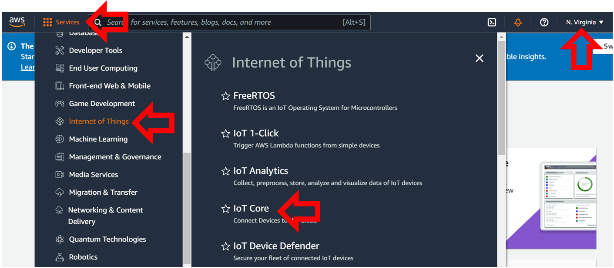
  <span class="caption"><b>Figure 1:</b> AWS Console View</span>
</div>

After setting up an account, log into the console. You should end up
seeing a page similar to Figure 1. After you are logged in, expand the
services and click on the Internet of Things and select IoT Core. If it
does not appear, make sure you have selected an Amazon AWS region at
which this service is active. We recommend that you use the <u>U.S. East
(North Virginia)</u> AWS server for this lab. The controls on the left
will list your setup certificates, things, rules, and policies. In the
bottom left corner of the screen, there is a *Learn* button and a link
to Amazon’s IoT *interactive* tutorial. Click on it, and go through the
tutorial for a *high-level explanation* about how AWS IoT uses Rules to
do cool things.

### Setting Up a Device Thing/Shadow

For the next part of the lab, you will need to generate the access keys
to allow your CC3200 to connect to your Amazon AWS account securely. For
a *real-world* device to connect to Amazon AWS you will need to do the
following:

1.  **Create a Device Thing/Shadow** (Device name, which can have
    variables created to interact with the device). This will generate a
    server-side representation of your *real-world* device (your thing).

2.  **Generate the required certificates and keys** for establishing an
    encrypted connection. (This is different from the Starfield Cert)

3.  **Attach the certificate and keys** to the Device Thing/Shadow.

4.  **Give the Device Thing/Shadow permission** to use the IoT functions
    of AWS.

These steps are done using the AWS IoT Console interface.

<div class="fig">
  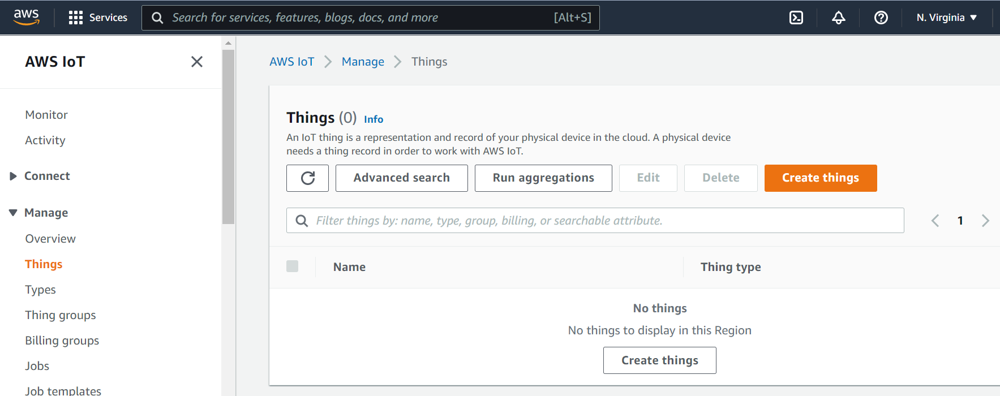
  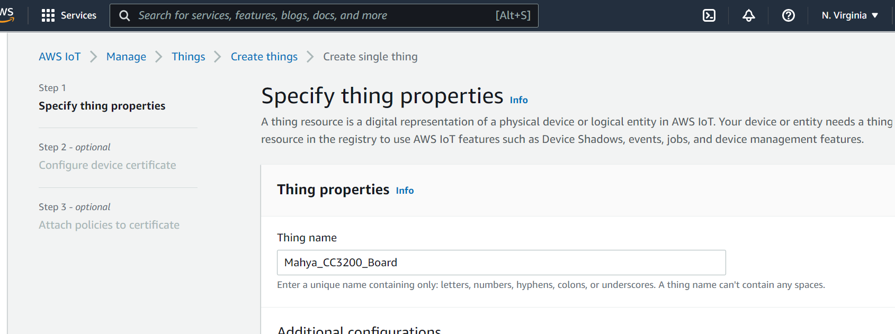
  <span class="caption"><b>Figure 2:</b> Creating a Thing</span>
</div>

1.  Return to the AWS IoT page and click on *Manage Things* and create a
    thing. On the next page select *Create single thing*. You should be
    presented with a display similar to Figure 2.

    - For your first device thing, it is recommended you give it a descriptive
      name, like `\<my_id_name\>\_CC3200Board` and leave the Type and 
      Attributes options blank. Select *Unnamed Shadow* option and
      click *Next*. Select *Skip creating a certificate* and create the thing.
      We will create the certificates later.

    - If everything is successful you should see something similar to Figure 3.

    <div class="fig">
      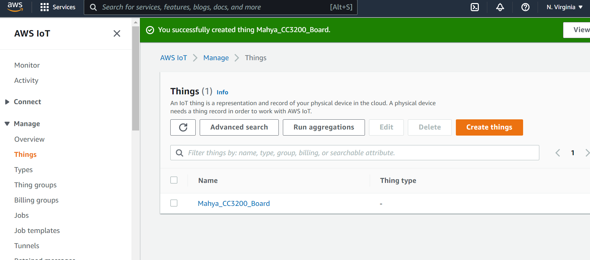
      <span class="caption"><b>Figure 3:</b> Thing created successfully</span>
    </div>

2.  Click on the thing you have just created. On the next page open *Device
    Shadow* tab and then click on your *classic shadow*. This will display
    information about how to interact with the AWS representation of the
    device thing, namely the device *shadow*. You should end up with a view
    similar to Figure 4.

    <div class="fig">
      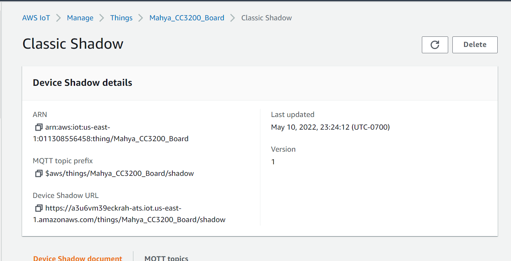
      <span class="caption"><b>Figure 4:</b> Detailed view of AWS Thing</span>
    </div>

3.  The REST API endpoint displays the web address for the AWS Thing/Shadow
    and contains the web address of your account’s AWS Endpoint. For now,
    copy the endpoint address into a word or text file, and save it for
    reference. You will need it later to connect to the AWS server. 

    - Below is an example Restful API endpoint address with the standard 
      endpoint address for the account highlighted. The initial string of 
      characters will be a unique string generated for your account by AWS, 
      like so: `https://<endpoint>/things/<thingName>/shadow`

    - Ex: `https://xxxxxxxxxxx.iot.us-west-2.amazonaws.com/things/CC3200_Thing/shadow`

    - Endpoint: "`<identifier>.iot.<region>.amazonaws.com`"

4.  After you have recorded your endpoint address, we can generate the
    required certificates, keys, and IoT permissions by opening the
    *SecureCertificates* tab and *Create certificate*. Use the
    *Auto-generate* method and select *active* for the certificate status.

    <div class="fig">
      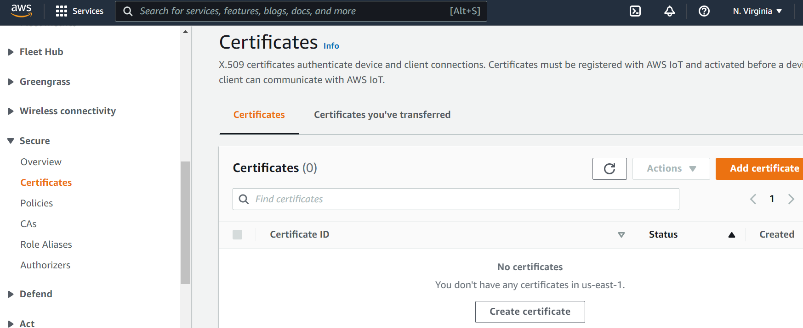
      <span class="caption"><b>Figure 5:</b> Connect a Device Screen</span>
    </div>

5.  AWS should generate the following items: 
    - public key
    - private key
    - RootCA certificate
    - certificate for device identification and traffic encryption

    You should be able to download these (as well as AWS IoT’s root
    certificate authority) to your computer. *You **MUST** download and save these
    files as **you will not be able to retrieve the public and
    private keys after you close the page.** **Only** Private
    and Device certificate will be used. RootCA has been provided on Canvas 
    (`StarfieldClass2CA.crt.der`)*. 
    - We suggest saving the files in a folder with the name of your Thing/Shadow 
    so that it is clear what keys/certificates correspond to which device. 
    - After downloading, don’t forget to *Activate* the certificate. 
      You can learn more about how these certificates are used 
      [here](https://docs.aws.amazon.com/iot/latest/developerguide/server-authentication.html).

    <div class="fig">
      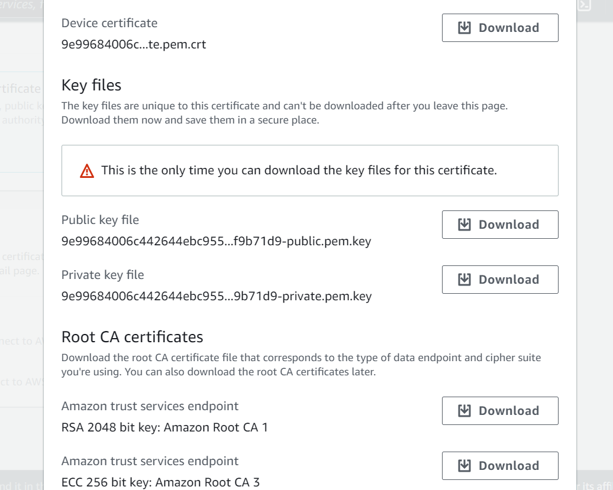
      <span class="caption"><b>Figure 6:</b> Download page for generated 
      Certificate and Key files</span>
    </div>

### Setting up an Access Policy for Device Shadows

To represent your *thing* (i.e. – our CC3200 board) in the cloud, AWS
uses the concept of a *device shadow* to which you can get the last
state, or push a new state to the server. This is useful when connection 
to a wireless network is intermittent, as the device could pull the previous
state from the cloud and maintain continuity. However, appropriate
configurations must be made on AWS to ensure that the devices have the
*privilege* to perform the actions requested. These next steps will walk
you through how to do this:

1.  On your IoT services panel, navigate to *Secure Policies* and create a
    new policy. Give your policy a descriptive name, and add two statements
    with actions “iot:GetThingShadow” and “iot:UpdateThingShadow”.
    Furthermore, update the Amazon Resource Number (ARN) to signify that
    these actions apply to your *thing* created previously (to find your ARN,
    see Figure 4). Be sure to select the *Allow* effect and finish
    creating the policy. You can learn more about the actions and other
    access management modules in the [AWS documentation](https://docs.aws.amazon.com/IAM/latest/UserGuide/access_policies.html).

  <div class="fig">
    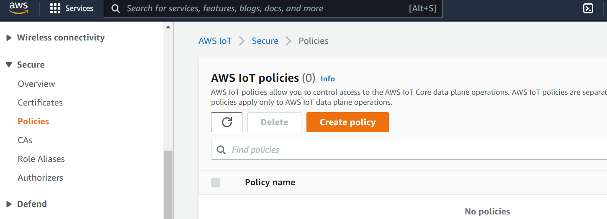
    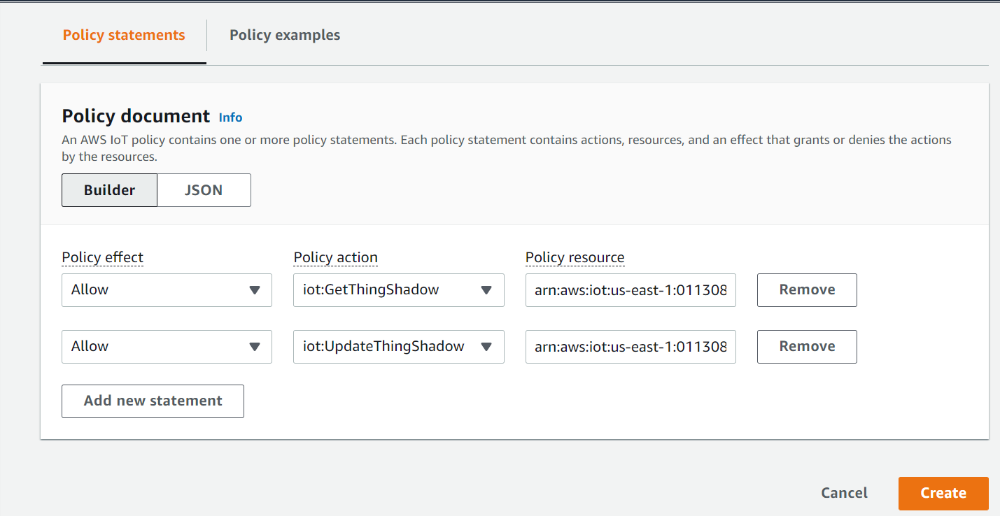
    <span class="caption"><b>Figure 7:</b> Adding a Policy to a Device</span>
  </div>

2.  Now that you’ve created a policy with appropriate privileges for our
    lab, let’s attach it to the certificate your created previously.

    - Navigate to the *Certificates* section (Figure 8) and select the
      certificate you have just created. 

    <div class="fig">
      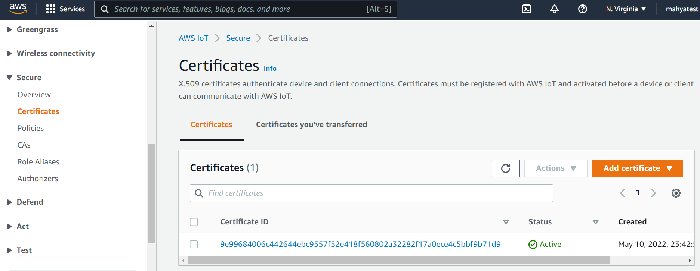
      <span class="caption"><b>Figure 8:</b> Select Created Certificate</span>
    </div>

    - Now select *ActionsAttach policy* (Figure 9). 
      Select the policy you just created and click "Attach". This will 
      allow you to use the GET and POST commands via REST from the device 
      associated with this certificate.

    <div class="fig">
      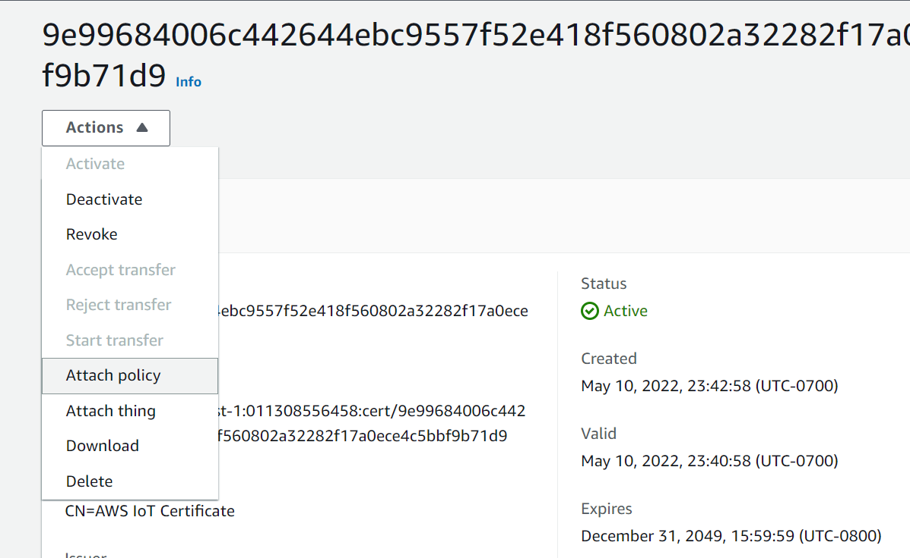
      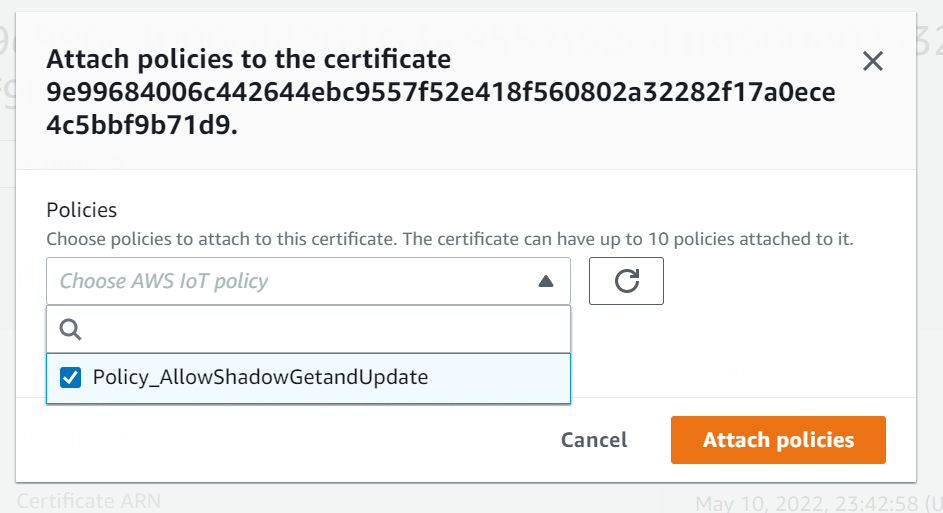
      <span class="caption"><b>Figure 9:</b> Attach a Policy to Certificate</span>
    </div>


### Converting Keys/Certificates with OpenSSL

In this part of the lab, you will convert the private key and
certificates to another format. This is necessary since AWS uses the
`.pem` format, while your CC3200 uses the `.der` format.

The connection security between the CC3200 board and AWS is guaranteed
through the TLS protocol. There are four components involved: the
**public** and **private key**, a **certificate** and a **root
certificate**. While the private key is used to decipher encrypted
messages, the certificate is used to validate the public key.
Certificates are built on a chain of trust, and so there is a root
certificate which is used to sign the certificate.

The key and certificates can exist in either `.pem` or `.der` format. The
former has ASCII-readable characters (unsecure, readable), while the
latter is in binary and more compact (still unsecure, but harder to
read). Your generated files in AWS are in the `.pem` format but the CC3200
requires the `.der` format.

To convert the files from `.pem` to `.der` format, we will use openSSL, an
open source library for transport layer security. 

> Note: You will need to modify your file names and file paths to
> where you saved your keys/certificates. If necessary, move the files
> that need to be converted into the same file directory that openSSL was
> installed in. The `rootCA` file will be shared among all of the CC3200s
> used for the project and debugging. The client and private keys should
> be unique to each device. It is highly recommended to group or name the
> files accordingly so that the keys/certificate pairs do not get mixed up
> or over-written.

> To reiterate: **You MUST use OpenSSL Version 1.1.1**.

#### Windows

1.  Install OpenSSL 1.1.1. The following link may be helpful: 
    <https://wiki.openssl.org/index.php/Binaries>
2.  Open a command prompt and navigate to the openSSL installation directory. 
    The commands that are needed are the following:
    - For the certificate file:
      ```console
      $ openssl x509 -outform der -in "C:\\<path\to>\certificate.pem.crt" -out "C:\\<path\to>\client.der"
      ```
    - For the Private Key File:
      ```console
      $ openssl rsa -outform der -in "C:\\<path\to>\private.pem.key" -out "C:\\<path\to>\private.der"
      ```

#### Mac

1.  Open Terminal and install OpenSSL in a new mamba/conda environment.
    ```console
    $ mamba create -n openssl1.1
    $ mamba activate openssl1.1
    $ mamba install -c conda-forge openssl=1.1.1 -y
    // check for correct version of openssl
    $ openssl version
    ```

2.  Navigate to the directory with the certificate and key files,
    then run the conversion commands:
    - For the certificate file:
      ```console
      $ openssl x509 -outform der -in "path/to/certificate.pem.crt" -out "path/to/client.der"
      ```
    - For the Private Key file:
      ```console
      $ openssl rsa -outform der -in "path/to/private.pem.key" -out "path/to/private.der"
      ```

### Updating the ServicePack

If the firmware on your CC3200 is out of date, you should use
UniFlash to update to the latest service pack. When you run
the application program on the CC3200, you should verify that you get 
the updated Build Version in one of the status messages. For example:

```
Host Driver Version: 1.0.1.6

Build Version 2.10.0.0.31.1.4.0.1.1.0.3.34
```
(exact numbers will be different.)

> Note: the Host Driver Version is currently hard-coded to `1.0.1.14`,
> however, you should have uploaded the most recent service pack `1.0.1.15`.

**Windows** (Preferred):
Open UniFlash and configure for CC3200. Then in the main page, select
`ServicePack Programming`, then navigate to your ServicePack directory
(not the same as the sdk directory) and select the `servicepack<...>.bin` file.
Hit ok and let it do its thing.

**Mac**:
For Mac users, you should be able to do the same using `cc3200tool`
with the following command:
```console
$ cc3200tool --sop2 \~rts --reset dtr \
format_flash --size=1M \
write_file --file-size=0x20000 \
     --signature <path/to/servicepack>/ota/ota_1.0.1.15-2.15.0.1.ucf.signed.bin \
     <path/to/servicepack>/ota/ota_1.0.1.15-2.15.0.1.ucf /sys/servicepack.ucf
```
(There is unfortunately currently no good way to confirm if this works.)

### Flash Key and Certificates to CC3200

To enable a secure connection from your CC3200, you need to download the
private key and certificates to your board. You will do this using the
UniFlash utility or `cc3200tool`, as described in the Uniflash tutorial.

You should flash the `.der` formatted certificates, *root certificate*
(used for authenticating the AWS server), *client certificate* (used by
AWS to authenticate our device), and the *private key* (for device-side
encryption) to **User Files** using the UniFlash utility, as shown in
Figure 10. You will specify the path to those files on your PC in the Url
box and select the Erase, Update, and Verify checkboxes, and click
*Program* to flash those files to the board. You can also load the
application (which you will develop in a later part) binary into
/sys/mcuimg.bin or you can download it from Code Composer Studio and run
it from the Debugger. Take note of the path of your files on the flash
(i.e. – the ‘Name’ field below) as you will need to reference them in
your code. If you forget them, you can list the files on your flash by
clicking on *List Files* in UniFlash.

<div class="fig">
  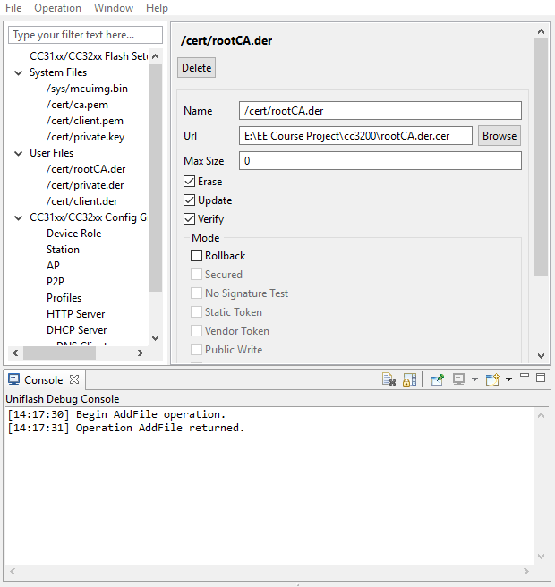
  <span class="caption">
    <b>Figure 10:</b> Sample Setup to Flash a Root Certificate Authority File
    <br>
    Note: You can ignore those `cert` files listed under "System Files" in the figure
  </span>
</div>

> To reiterate: the cert files should be inside “User Files”. You can find 
> an “add file” button near “program” and the path you use in your code
> should be exactly match the path you set in UNIFLASH, including
> the leading forward slash ‘/’.

### Communicating with AWS IoT

Amazon’s RESTful API for AWS IoT provides access to *device shadows*, or
*thing shadows*. These are JavaScript Object Notation (JSON) formatted
data that allow state information for AWS things to be stored and
retrieved, even when a device might be disconnected from the service. To
store or retrieve data from a device shadow, Amazon provides special
MQTT feeds and RESTful API calls.

For example, the return values of the GET and POST requests respectively are:
- **GET Method: (GetThingShadow)**
  ```
  GET /things/<thingName>/shadow HTTP/1.1

  Host: <identifier>.iot.<region>.amazonaws.com

  Connection: Keep-Alive
  ```

- **POST Method: (UpdateThingShadow)**
  ```
  POST /things/<thingName>/shadow HTTP/1.1

  Host: <identifier>.iot.<region>.amazonaws.com

  Connection: Keep-Alive

  Content-Type: application/json; charset=utf-8

  Content-Length: <length>

  {
    "state":{
      "desired":{
        “color":"green"
      }
    }
  }
  ```

To send a RESTful API POST message to AWS, the service must first be
connected to with the SimpleLink socket library. The initial connection
should be to the base address for the service or website you are trying
to communicate. 

For example, rather than the entire REST path, you would only connect to 
the domain: `<endpoint>.iot.<region>.amazonaws.com`. 

The HTTPS part of the address will be managed based on the socket 
credentials, and the AWS device thing subdirectory will be used in the 
RESTful API calls.

The connection should have the following configurations to connect to 
AWS IoT:
- TLS1.2
- Cipher: TLS ECDHE RSA with AES 256 CBC SHA
- Port: 8443
- Certificates/Keys needed: 
  - Certificate Authority for AWS (rootCA.der)
  - x509 Device Certificate (cert.der)
  - Private Key (private.der)

The RESTful API application requires Internet connectivity through an
Access Point (AP). The AP details are contained in the header file
`common.h`. **Modify the common.h header file, if necessary, to match the
following configuration for the AP in the lab:**

```c
// Values for below macros shall be modified as per access-point (AP) properties
// SimpleLink device will connect to following AP when application is executed
#define SSID_NAME "eec172"              /* AP SSID */
#define SECURITY_TYPE SL_SEC_TYPE_OPEN  /* Security type (OPEN or WEP or WPA)*/
#define SECURITY_KEY ""                 /* Password of the secured AP */
#define SSID_LEN_MAX 32
#define BSSID_LEN_MAX 6
```

**Once `common.h` has been modified, you can build and test the example
 program.** 

> Note: `common.h` may not reside in your workspace, so
> if you work on the lab computers *and* your personal laptop you will
> need to modify them in both places, and with the appropriate settings
> for the wireless network you are trying to connect with.

Another important change is that *the secure client application must have
the “current” date and time so that the credentials can be verified as
valid*. In this example, we use variables in the main program to update
the date and time. The date and time only need to be relatively recent. 
Having the date and time hard-coded into the program is obviously not 
a robust or secure programming method since the code will eventually 
stop working unless periodically updated. However, in the interest of 
reducing complexity, we will use this method for this lab. 

The date and time variables are stored in the following constants
in `main.c`. **Update these values every time you reprogram the device**:

```c
//NEED TO UPDATE THIS FOR IT TO WORK!
#define DATE      10 /* Current Date */
#define MONTH      5 /* Month 1-12 */
#define YEAR    2016 /* Current year */
#define HOUR      17 /* Time - hours */
#define MINUTE     0 /* Time - minutes */
#define SECOND     0 /* Time - seconds */
```

Now your CC3200 should be able to connect securely to AWS.

> Note: If you have curl installed on your computer, you can check the 
> certificate you downloaded using the following command:
> ```
> curl --tlsv1.2 "https://ENDPOINT.iot.us-east-1.amazonaws.com:8443/things/THING_NAME/shadow" \
>   --cacert AmazonRootCA1.pem \
>   --key KEY_ID-private.pem.key \
>   --cert KEY_ID-certificate.pem.crt
> ```
> 
> Please note that the port number *must* be 8443
>
> You can also check the DER files with a similar command:
> ```
> curl --tlsv1.2 "https://ENDPOINT.iot.us-east-1.amazonaws.com:8443/things/THING_NAME/shadow" \
>   --cacert AmazonRootCA1.pem \
>   --key private.der \
>   --cert client.der \
>   --cert-type DER --key-type DER
> ```

---

### *Lab Checkoff Task 1*

**Demonstrate that you can use a POST request to post state to your 
AWS thing and use a GET request to obtain status information on your 
AWS thing. You should receive an HTTP 200 status code, showing a 
successful POST or GET request, as well as some basic status information 
about your device thing.**

> Note: you need to give your thing shadow some initial state before you
> can do an HTTP GET on it. You can give the shadow state by using the
> HTTP POST command or by using the AWS web interface.

In this part, you can start with the working example project
`lab4-blank.zip` uploaded on Canvas. 

> To build it, you will need to ensure that your `CC3200_SDK_ROOT` variable 
> is set. The instructions to verify this as follows:
> 
> 1. Right-Click on your project name and select `Show Build Settings`.
> 1. Select `Build` on the right side of the window, then select the 
>    `Variables` tab.
> 1. Check `Show System Variables` and search for the `CC3200_SDK_ROOT`
>    variable. If it is present, double-click it, otherwise select
>    `Add New` on the right side.
> 1. Make sure the variable type is "Path", and in the value box, enter the
>    file system path to your SDK folder.

You will need to examine it carefully to understand it and modify it 
appropriately. In particular, you should examine the `http_post()` 
function to see how the HTTP command is sent to AWS. 

The data must be formatted properly or AWS (or any other web service) 
will not accept it as valid. In order to use this project on
your system, you may need to modify the following files or parameters:

1.  `common.h` – as described above for the "eec172" Access Point.

2.  `main.c` – you will need to use your own AWS endpoint path and thing
    name as well as changing the HTTP command in order to test both GET
    and POST. You should also change the message data that you post to
    your thing. However, be careful to keep the correct data format. You
    may also need to update the date, as described above.

3.  `pinmux.c` – verify that the `pinmux.c` file sets up the pins that you
    intend to use. For the default application, only the UART0 and GPIO
    signals driving the on-board LED are actually used. If your program
    uses the same pins as the on-board LEDs, you will have problems.

4.  Flash the private key and the client certificates and root
    Certificate Authority into the CC3200 flash, as already described.

**Demonstrate your working program to your TA to receive checkoff.
You may continue to the next part in the meantime.**

---

## Part II: Using SNS to Send a Message to Email

For this part, you will compose a text message using your IR
remote and send it to your email. This will be accomplished by
setting up a *topic* in the Simple Notification Service, registering
your email, and establishing a *Rule* in the IoT service to trigger when
you update your device shadow to send messages to your email. 

To do this you must perform the following:
1.  Create a thing for the cc3200 as you have done before.
2.  Create an SNS topic.
3.  Subscribe to the SNS topic with your email.
4.  Create a rule to forward incoming thing messages to your SNS topic.
5.  Use the REST API to post to your topic.

> Note: For this lab we *highly* recommend that you use the “US East (North
> Virginia)” AWS server, as some servers are not compatible with certain 
> AWS IoT services.

We will walk you through **creating an SNS topic** and
**creating a rule**.

> Note: If any step requires a “role”, you can create one of your own
> to continue.

### Creating an SNS Topic

Amazon Web Services has a collection of different web services which can
be integrated to perform a larger function. So far you have been using
the IoT service to communicate the states of *real-world devices or
things* to the cloud. The Simple Notification Service (SNS) is another
module that will allow you to push messages to subscribers. 

1.  Navigate to the SNS service by expanding the services tab and finding 
    SNS under *Application Integration* (Figure 11), and create a new 
    standard topic (Figure 12). 

    <div class="fig">
      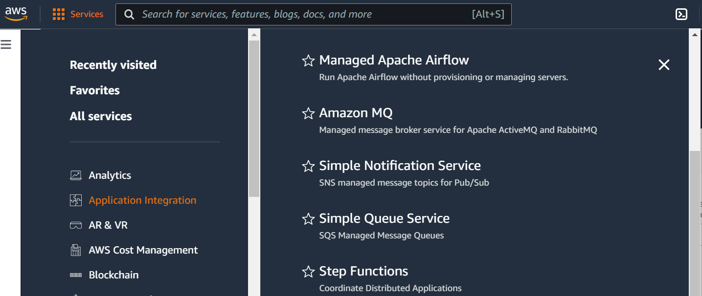
      <span class="caption"><b>Figure 11:</b> AWS Simple Notification Service</span>
    </div>

    <div class="fig">
      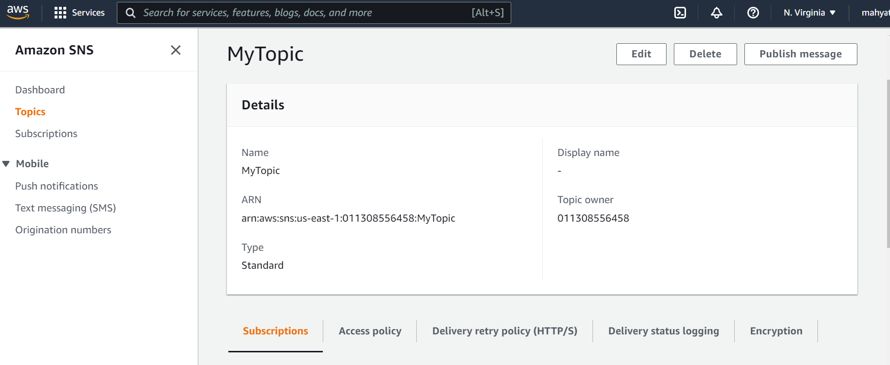
      <span class="caption"><b>Figure 12:</b> Creating a Topic</span>
    </div>

2.  Afterwards, create a subscription, where the protocol is *EMAIL* 
    for text messages. The endpoint is the email address that will receive
    the messages. (Figure 13)

    <div class="fig">
      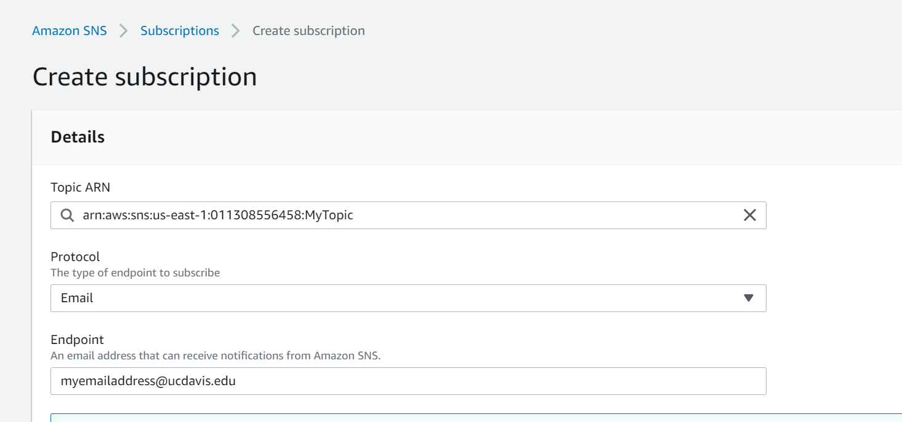
      <span class="caption"><b>Figure 13:</b> Creating a Subscription</span>
    </div>

3.  Open your email and confirm the subscription. 
    
4.  Test that the module works by clicking on the ‘Publish message’ button 
    on top of the page to manually send a text message from the AWS Console 
    to your email (use RAW format for now).


### Creating an IoT Rule

The next step is to create an IoT Rule that will trigger when you push
updates to your shadow device. Earlier in the lab, we updated our device
shadow (state) via the REST api. When our device shadow is updated, the
IoT module publishes messages to several reserved Message Queue
Telemetry Transport ([MQTT](https://en.wikipedia.org/wiki/MQTT)) topics,
a publish-subscribe ‘lightweight’ messaging protocol. 

In order to trigger your rule, we will configure AWS to listen for 
updates to the device shadow via these topics. A full list of reserved 
topics that can be subscribed to can be found 
[here](https://docs.aws.amazon.com/iot/latest/developerguide/device-shadow-mqtt.html).

1.  Navigate to the *ACT(Message Routing)Rules* section in the IoT module,
    and create a new rule. (Figure 14)
    - You should listen to the topic 
      `$aws/things/<thingName>/shadow/update/accepted` (the \$ should 
      be *included*), report on the attribute ‘state.desired’, and leave 
      the condition blank. 

    <div class="fig">
      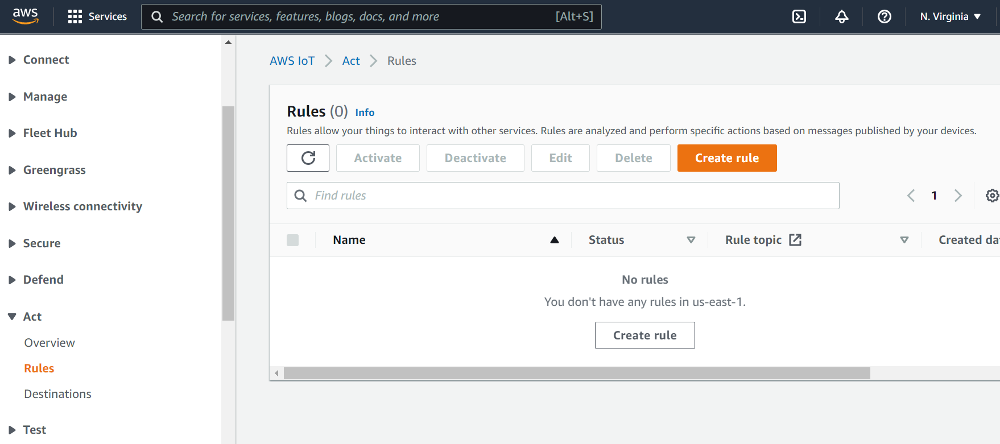
      <span class="caption"><b>Figure 14:</b> Creating a Rule</span>
    </div>

2.  Attach an action that will send an SNS push notification when the 
    rule is triggered. 
    - Select the SNS target to be the topic you created previously, 
      and use the ‘RAW’ message format (for now). 
    - You will also need to create an IAM role to allow the IoT to
      access the SNS service ‘securely’ (you can learn more about 
      Identity Access and Management [IAM] roles [here](https://docs.aws.amazon.com/iot/latest/developerguide/iam-users-groups-roles.html)
      but will not need to understand them for this lab). Your SQL query
      statement for your rule should be similar to Figure 15.

    <div class="fig">
      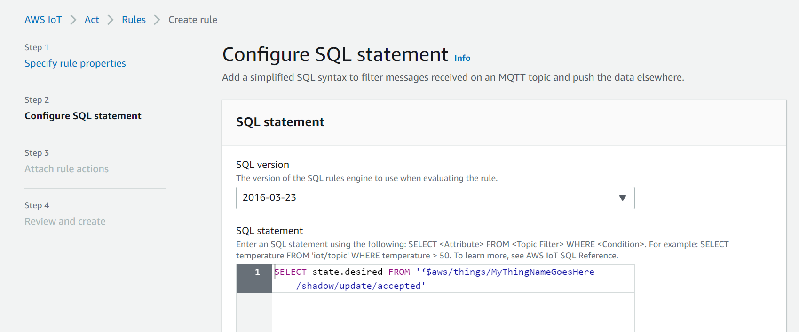
      <span class="caption"><b>Figure 15:</b> Setting up your IoT Rule</span>
    </div>

3.  Make sure the rule is *enabled* and try to push an update to your
    device shadow using your CC3200. In a couple of seconds you *should*
    get an email. Once that you works, you can clean up the formatting using
    JSON message format SNS action. 
    - To understand the JSON message format, go back to the SNS topic you 
      made, click the *Publish a topic* button, and experiment with the 
      `JSON message generator` to find the appropriate syntax. 
    - Determine how you will need to modify your SQL statement to "clean up" 
      your message. [More on SQL-like formatting](http://docs.aws.amazon.com/iot/latest/developerguide/iot-sql-reference.html).

    > HINT: look at left bar, where there is more information. You may want to
    > focus on “SELECT clause” part of SQL reference.

<div class="fig">
  <div style='display: inline-block; vertical-align: bottom;'>
    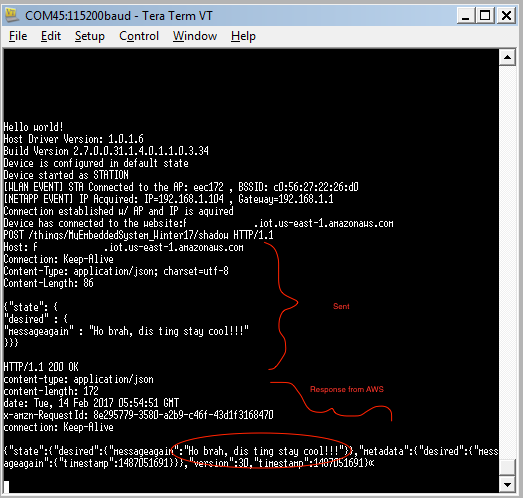
    <span class="caption">CC3200 Log</span>
  </div>
  <div style='display: inline-block; vertical-align: bottom;'>
    &nbsp;&nbsp;&nbsp;&nbsp;
  </div>
  <div style='display: inline-block; vertical-align: bottom;'>
    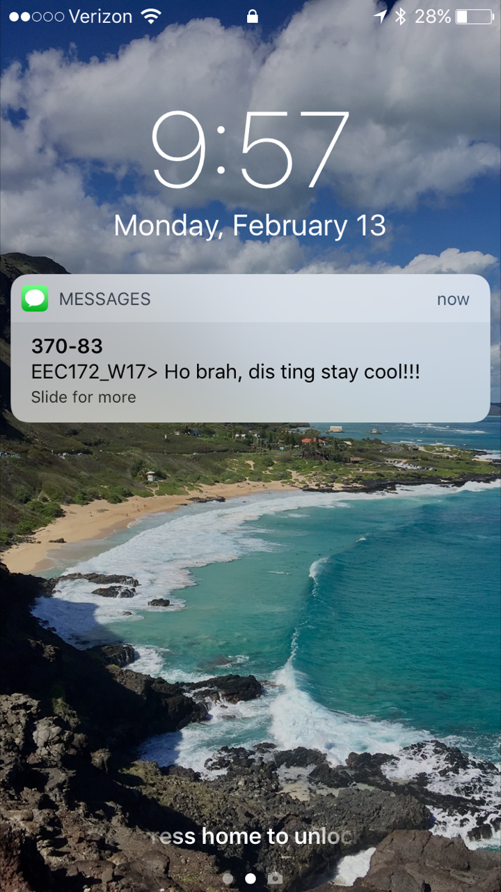
    <span class="caption">Example Notification</span>
  </div>
  <span class="caption"><b>Figure 16:</b> Working Demo</span>
</div>

---

### *Lab Checkoff Task 2*

**Demonstrate to your TA that you can receive a clean sample message
using the JSON message format to receive checkoff.
You may continue to the next part in the meantime.**

---

## Part III: Integrate IR Remote Texting

Now that you know have the SNS module and IoT Rules set up
appropriately, you can start integrating your IR remote text
messaging code (Lab 3) to send a text to your email. Start with the
program for connecting to AWS via the REST API that you implemented in
the last part. When you are done, you will be sending a text from your
IR remote, to the CC3200, and then through the cloud to your email.
Cool, yeah?

---

### *Lab Checkoff Task 3*

**Integrate the IR Remote Multi-Tap Texting interface with your code 
from Task 2 to send custom messages to your email.**

The multi-tap texting interface is the same as that implemented in 
[lab3](../lab3.html) Part IV.

> Note: If you were unable to implement Multi-Tap Texting in the previous
> lab, you can use the UART console as your interface without penalty.

**Demonstrate your working program to your TA to receive checkoff.**


## Resources

- [Beginner's Guide to Creating a REST API](https://www.andrewhavens.com/posts/20/beginners-guide-to-creating-a-rest-api)
- [An Overview of HTTP](https://developer.mozilla.org/en-US/docs/Web/HTTP/Overview)
- [AWS IoT Quickstart](https://docs.aws.amazon.com/iot/latest/developerguide/iot-quickstart.html)
- [AWS IoT Protocols](https://docs.aws.amazon.com/iot/latest/developerguide/protocols.html)
- [AWS IoT Managing Devices](https://docs.aws.amazon.com/iot/latest/developerguide/iot-thing-management.html)
- [AWS IoT Device Shadows](https://docs.aws.amazon.com/iot/latest/developerguide/iot-device-shadows.html)
  - [Interacting with Shadows](https://docs.aws.amazon.com/iot/latest/developerguide/device-shadow-data-flow.html)
  - [Shadow REST API](https://docs.aws.amazon.com/iot/latest/developerguide/device-shadow-rest-api.html)
- [AWS IoT Rules](https://docs.aws.amazon.com/iot/latest/developerguide/iot-rules.html)
  - [AWS IoT Create Rule](https://docs.aws.amazon.com/iot/latest/developerguide/iot-create-rule.html)
  - [AWS IoT Rule SQL Reference](https://docs.aws.amazon.com/iot/latest/developerguide/iot-sql-reference.html)
  - [Shadow MQTT Topics](https://docs.aws.amazon.com/iot/latest/developerguide/device-shadow-mqtt.html). HTTP requests can be used to publish to these MQTT topics, which in turn can be used to invoke a rule.
- [AWS IAM](https://docs.aws.amazon.com/IAM/latest/UserGuide/introduction.html)

- [CC32xx SSL Demo Application](https://processors.wiki.ti.com/index.php/CC32xx_SSL_Demo_Application):

<!-- 
Configuring the AWS CLI client to connect to the Amazon Servers:
<http://docs.aws.amazon.com/cli/latest/userguide/cli-chap-getting-started.html>
 -->


---

## Lab Report

Refer to the [general lab report instructions](lab-report.html) for general
formatting and guidelines.

Your lab report should include:
- A soft-copy of your well-written, *well-commented* code for Task 3
  - Include your names in the header comments of the file containing your
    main program.
  - This can be a copy of the entire project directory (which you can export
    in CCS to a zip file by Right-Clicking the project name and selecting 
    `Export -> General -> Archive File` and specifying the location)
- A well-written PDF report that contains, in addition to the general 
  guidelines:
  - *An written description of your program that explains how each section 
    section of your code works and why it is necessary.*
    - *In particular, you should describe each action taken in the 
      `http_get` and `http_post` methods.*
  - *A description of any noteworthy difficulties you encountered in 
    constructing your solution*.